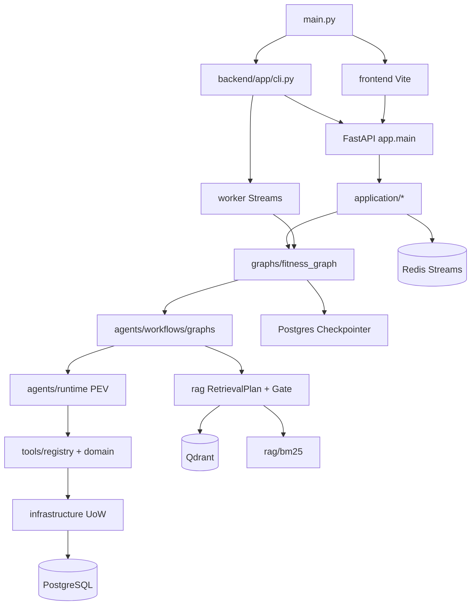

# FitPilot

个性化训练与膳食协同 AI Agent：面向健身与膳食场景的个人助手。目标用户为希望在本地完成档案管理、打卡、训练/饮食计划、知识问答与 Agent 对话的终端用户与二次开发工程师。运行形态为 **Vue 3 前端 + FastAPI 后端** 的本地/容器 Web 系统，并可选 Redis Streams Worker。输入包括用户档案、打卡、自然语言对话与知识库文档；核心处理为确定性营养/计划计算、RAG 混合检索与 LangGraph 领域子图；输出为结构化 API 响应、计划预览/确认写库、带引用的问答与 SSE 任务进度。

当前实现覆盖：阶段 1–3 MVP、工程审查 P0/P1、**Agent/RAG 增强方案主干**（可靠队列、结构化路由与 clarify、PEV、可编译子图、Application/Repository、受控记忆、类型感知分块、Evidence Gate、增量知识入库/回滚/快照、离线 CI 门禁、演示数据）。**不提供**疾病诊断、伤病治疗、教练端 SaaS，或未经用户确认的自动写库。

包名 `fitpilot-backend`（`backend/pyproject.toml`）；CLI 入口名 `fitpilot`；前端包名 `fitpilot-frontend`。本文档为全量归档版，路径均相对仓库根目录。增强落地说明见 [`docs/ENGINEERING_ENHANCEMENT.md`](docs/ENGINEERING_ENHANCEMENT.md)；架构图见 [`docs/ARCHITECTURE.md`](docs/ARCHITECTURE.md)；演示清单见 [`docs/DEMO.md`](docs/DEMO.md)。

---

## 1. 项目整体介绍

### 1.1 项目核心用途

FitPilot 解决的问题是：在个人健身场景中，把 **结构化业务数据**（档案、食物库、动作库、计划、打卡）与 **非结构化知识**（指南、FAQ、上传文档）统一到同一助手里，同时用确定性代码计算热量/宏量与计划约束，避免大模型直接编造数值或擅自写库。

| 维度 | 说明 |
|------|------|
| 目标用户 | 个人训练者；本地部署与二次开发工程师 |
| 业务场景 | 注册登录、档案与营养目标、食物/动作检索、训练饮食打卡、计划预览确认、知识问答、Agent 对话 |
| 形态 | Web（前后端分离）+ Typer CLI + 可选 Docker Compose 生产栈 |
| 输入 | HTTP/JWT 请求、SSE 客户端、CLI、知识库文件、评测 JSON |
| 处理 | SQLAlchemy/Postgres、RAG（Qdrant+BM25）、Ollama 生成、LangGraph、OR-Tools/贪心食谱 |
| 输出 | JSON API、计划版本写入、引用问答、评估报告、Prometheus 指标 |
| 实现范围 | 见 1.2；路线图中未落地能力不以已实现功能描述 |

### 1.2 核心功能清单

| 功能 | 入口 | 对应文件 | 调用模块 | 输入 | 输出 | 外部依赖 | 使用限制 |
|------|------|----------|----------|------|------|----------|----------|
| 注册/登录/刷新/登出 | `POST /auth/*` | `backend/app/api/auth.py` | `core/security.py`、`models` | 邮箱密码 / refresh | JWT + refresh | Postgres | 生产必须更换 `JWT_SECRET` |
| 用户档案读写 | `GET/PUT /users/me/profile` | `backend/app/api/users.py` | `nutrition.py` | 身高体重目标等 | 档案 + TDEE/宏量 | Postgres | 需登录 |
| 食物库 | `GET/POST /foods` | `backend/app/api/foods.py` | `food_seed`/`food_fdc` | 查询/创建 | `food_items` | Postgres | 种子依赖 FDC/中文包 |
| 动作库 | `GET /exercises*`、`POST /shuffle` | `backend/app/api/exercises.py` | `exercise_seed.py` | 器械×部位 | 动作列表 | Postgres | 需先 `seed-exercises` |
| 打卡 | `/workouts/logs` 等 | `backend/app/api/logs.py` | 宏量换算 | 日志体 | 持久化日志 | Postgres | 饮食宏量由食物库计算 |
| 计划预览/确认/回滚/周调整/换菜 | `/plans/*` | `backend/app/api/plans.py` | `tools/domain.py`、`meal_optimizer.py`、`weekly_adjustment.py` | 预览参数 | 计划/Diff | Postgres、OR-Tools 可选 | 写库需 approve |
| 知识问答（RAG） | Agent `rag` 节点 / `POST /knowledge/search` | `backend/app/rag/*`、`graphs/fitness_graph.py` | Embedding、Qdrant、BM25、Ollama | 自然语言 | reply+citations 或拒答 | Qdrant、Ollama、本地权重 | 需 ingest；admin 入库 |
| Agent 对话/SSE | `/agent/chat`、`/tasks`、`/stream` | `backend/app/api/agent.py` | Application + `run_fitness_agent` | message | 任务事件流 | Postgres、可选 Redis Streams | 输入经 `InputSanitizer`；事件权威源为 Postgres |
| 计划 interrupt 确认 | `POST /agent/tasks/{id}/approve` | `api/agent.py`、`application/agent/` | Checkpointer + 子图 | approve bool | 续跑 commit/reject | Postgres | 须处于 awaiting；幂等 |
| 任务取消/恢复 | `/agent/tasks/{id}/cancel`、`/resume` | `application/agent/lifecycle.py` | Checkpointer | — | 状态变更 | Postgres | 已结束任务 cancel 幂等 |
| 受控记忆 | `/memories*` | `api/memories.py`、`agents/memory/` | `application/memories` | key/value | 确认后可写回档案 | Postgres | 未确认推断不写档案 |
| Worker 异步 | `fitpilot worker` | `backend/app/worker/*` | Redis Streams Consumer Group | 队列 JSON | 同 Agent 结果 | Redis | 需 `AGENT_USE_WORKER=true`；含 ACK/重试/死信 |
| 知识入库 | CLI `ingest` / `knowledge-ingest` / `/knowledge/ingest*` | `rag/ingest.py`、`knowledge_lifecycle.py` | 解析器+类型分块 | 文件路径 | Qdrant+BM25+manifest | 本地文件 | API 需 admin；支持增量/回滚/快照 |
| 健康/指标 | `/health`、`/health/ready`、`/metrics`、`/metrics/tokens` | `api/health.py`、`main.py` | 各客户端 | 无 | 状态 JSON/Prometheus | 依赖服务 | ready 探测外部服务 |
| 九层评估 / 离线门禁 | `fitpilot eval-all`、`eval-gate` | `backend/app/eval/*` | `evals/*.json` | 用例集 | 报告；可 `--persist` | 部分层需 Ollama | CI 跑 `eval-gate`；`/eval` 查询需 admin |
| 一键演示数据 | `fitpilot seed-demo` | `scripts/seed_demo.py` | users/logs | — | demo 账号+两周打卡 | Postgres | 见 `docs/DEMO.md` |
| 前端 UI | Vite 页面 | `frontend/src/views/*` | Pinia stores | 用户操作 | 轨迹/证据/审批 Diff | 后端 API | 路由守卫 |

实际 Agent 实现在 `backend/app/graphs/` 与 `backend/app/agents/`（路由、子图、PEV、记忆）；评估在 `backend/app/eval/`。

### 1.3 程序启动执行主线

**后端 API（开发）：**

1. 入口：`python main.py api`（根）或 `cd backend && uv run python main.py api` / `uv run fitpilot api`
2. `backend/app/cli.py` → `_start_api` → `uvicorn.run("app.main:app", ...)`
3. `backend/app/main.py`：`setup_logging()`、`get_settings()`、挂载 CORS、双前缀 `api_router`、`/metrics`、启动日志打印模型角色
4. 请求进入中间件：注入 `X-Request-ID`、Prometheus 计数
5. 路由 → `deps.get_current_user`（如需）→ 业务服务 / `run_fitness_agent` / RAG
6. 结果 JSON 或 SSE；Token 超预算抛 `TokenBudgetExceeded` → 429
7. 进程退出：Ctrl+C 停止 uvicorn（无专门 atexit 写盘逻辑）

**前端：**

1. `python main.py web` → `pnpm start`（`frontend/`）
2. `frontend/src/main.ts` 挂载 Vue；`router` 守卫检查登录
3. Axios（`api/client.ts`）带 Bearer；401 尝试 refresh

**Agent Worker（可选）：**

1. `fitpilot worker` → Redis Streams Consumer Group（`fitpilot:agent:tasks`）→ ACK / 认领 / 死信 → `run_fitness_agent` → `finalize_agent_result`；任务结束后写会话摘要到 `session_memories`

### 1.4 典型使用流程

**案例 A：知识问答**

1. 用户打开 `/chat`，发送「增肌每天蛋白怎么算」
2. `POST /agent/tasks` → `InputSanitizer.sanitize` → Application `create_agent_task`
3. 结构化 `route_intent` → `knowledge_query` → 知识子图
4. `RetrievalPlan` + `retrieve_with_plan`（Dense + BM25 → RRF → 可选 rerank）→ Evidence Gate → `build_context` / Citation 映射
5. 证据不足则拒答；否则 `OllamaClient.chat`（角色 `rag`）返回 `reply` + `citations`
6. SSE 仅从 `agent_task_events` 推送（支持 `Last-Event-ID`）；前端渲染轨迹与证据面板

**案例 B：生成/调整计划（含人工确认）**

1. 用户说「根据我最近两周的训练记录调整饮食和训练」
2. 意图 `plan_adjust`（复杂任务）→ 计划子图 PEV：档案 → `recent_logs` → `weekly_adjust_preview`
3. `plan_approval` 子图 `interrupt()`；SSE `approval_required`（含 Diff、数据依据、风险提示、可否回滚）
4. 用户 `POST /agent/tasks/{id}/approve`（幂等）
5. 恢复图 → `commit_plan_use_case`（Unit of Work 写计划版本 + 审计）
6. 若拒绝则 `plan_reject`，不写有效计划

**案例 C：从零灌库 + 演示**

1. `docker compose -f docker-compose.dev.yml up -d`
2. `cd backend && uv run python main.py migrate`
3. `seed-exercises`、`seed-foods`、`seed-demo`、`knowledge-ingest --incremental`（或 `ingest`）
4. 启动 `api` + 根目录 `python main.py web`，用 `demo@fitpilot.local` / `demo123456` 登录

---

## 2. 技术栈详细清单

### 2.1 编程语言与版本

| 语言 | 版本约束 | 依据 | 特性使用 | 不匹配风险 |
|------|----------|------|----------|------------|
| Python | `>=3.11,<3.13` | `backend/pyproject.toml` `requires-python` | `str \| None`、`TypedDict`、async | 3.10 语法失败；3.13 未声明支持 |
| TypeScript | `~5.7.2` | `frontend/package.json` | Vue SFC + `vue-tsc` | 构建类型检查失败 |
| 前端运行时 | ES modules | `"type": "module"` | Vite 6 | 旧 Node 可能不兼容 |

### 2.2 框架、运行时与构建工具

| 名称 | 版本约束 | 作用 | 使用位置 |
|------|----------|------|----------|
| FastAPI | `>=0.115.0` | HTTP API | `backend/app/main.py`、`api/` |
| Uvicorn | `>=0.32.0` | ASGI | `cli._start_api` |
| SQLAlchemy asyncio | `>=2.0.36` | ORM | `db/session.py`、`models/` |
| Alembic | `>=1.14.0` | 迁移 | `alembic.ini`、`migrations/` |
| Typer | `>=0.15.0` | CLI | `backend/app/cli.py` |
| LangGraph | `>=0.2.0` | Agent 图 | `graphs/fitness_graph.py` |
| langchain-ollama | `>=0.2.0` | LLM 适配 | `services/ollama_client.py` |
| Vue 3 / Vite 6 / Pinia / Vue Router / Element Plus | 见 `frontend/package.json` | SPA | `frontend/src/` |
| uv | 项目约定 | Python 依赖 | `backend/` |
| pnpm | 根 CLI 查找 | 前端依赖 | `main.py` `_run_web` |
| Docker Compose | 仓库文件 | 基础设施/生产 | `docker-compose.*.yml` |

### 2.3 第三方依赖

后端直接依赖声明于 `backend/pyproject.toml`（核心行）：

| 依赖名称 | 版本约束 | 声明位置 | 实际使用位置 | 核心用途 | 是否必需 | 注意事项 |
|---|---|---|---|---|---|---|
| fastapi | >=0.115.0 | pyproject | `app/main.py`、`api/` | Web API | 是 | — |
| uvicorn[standard] | >=0.32.0 | pyproject | `cli.py` | 服务进程 | 是 | — |
| pydantic / pydantic-settings | >=2.9 / >=2.6 | pyproject | `core/config.py`、schemas | 配置与校验 | 是 | — |
| sqlalchemy[asyncio] / asyncpg | >=2.0.36 / >=0.30 | pyproject | `db/`、`models/` | 异步 Postgres | 是 | 需 Postgres |
| alembic | >=1.14.0 | pyproject | 迁移 | Schema | 是 | — |
| redis | >=5.2.0 | pyproject | `worker/redis_queue.py`、ready | 缓存/队列 | 就绪与 Worker | — |
| python-jose / passlib[bcrypt] | >=3.3 / >=1.7.4 | pyproject | `core/security.py` | JWT/密码 | 是 | — |
| httpx / tenacity | >=0.28 / >=9.0 | pyproject | Ollama 客户端等 | HTTP/重试 | 是 | — |
| qdrant-client | >=1.12.0 | pyproject | `services/qdrant_client.py` | 向量库 | RAG 必需 | — |
| structlog / prometheus-client | >=24.4 / >=0.21 | pyproject | logging、metrics、`/metrics` | 可观测 | 是 | — |
| langgraph / langchain-core / langchain-ollama | 见 pyproject | graphs、ollama | Agent/LLM | 是 | — |
| sentence-transformers / torch / transformers | 见 pyproject | embeddings、rerank | 向量/精排 | RAG 完整模式 | 可用 `RAG_OFFLINE` 降级 |
| pypdf / python-docx / python-pptx / openpyxl / bs4 / lxml / pillow | 见 pyproject | `rag/parsing/` | 多格式解析 | 入库相关 | — |
| ortools | >=9.11.0 | pyproject | `meal_optimizer.py` | 食谱 SCIP | `MEAL_USE_ORTOOLS` | 失败回退贪心 |
| typer | >=0.15.0 | pyproject | `cli.py` | CLI | 是 | — |

开发组（`[project.optional-dependencies] dev` / `[dependency-groups] dev`）：`ruff`、`mypy`、`pytest`、`pytest-asyncio`。

前端直接依赖：`vue`、`vue-router`、`pinia`、`axios`、`element-plus`、`@element-plus/icons-vue`；开发：`vite`、`@vitejs/plugin-vue`、`typescript`、`vue-tsc`、`sass`。

**代码导入但需运行时环境变量/可选行为：** `RAG_OFFLINE`、OCR（`RAG_ENABLE_OCR`，依赖系统 Tesseract 时才有实际 OCR 能力——现有项目文件中未捆绑 Tesseract 安装脚本，故 OCR 需本机自行具备）。

**依赖已声明且在 RAG/评估/优化路径中使用：** 上表所列均为直接依赖；未对传递依赖做完整审计。

**未声明却可能由环境注入：** 无额外强制系统 pip 包；Ollama、Docker、pnpm、uv 为系统级工具。

### 2.4 系统环境要求

- 操作系统：开发在 Windows 上验证较多；Compose 与 Python 路径处理跨平台。
- CPU/内存：定性上 Embedding/Reranker/Ollama 为主要消耗；6GB 显存场景在 `.env.example` 注释中按错峰设计（Embedding/Reranker 默认 `cpu`）。
- GPU：可选；`EMBEDDING_DEVICE`/`RERANKER_DEVICE` 可设 `cuda`。
- 磁盘：`models/`（gitignore）、Qdrant 存储、Postgres 卷、语料 PDF。
- 网络：访问本机 Ollama/Qdrant；可选 HuggingFace 镜像 `HF_ENDPOINT`。
- 外部命令：`docker`/`docker compose`、`ollama`、`pnpm`、`uv`、`pg_dump`（备份脚本使用时）。

现有文件中**未**给出经基准测试的最低 CPU/RAM 数字，故不虚构具体最低配置。

### 2.5 外部服务与资源

| 服务/资源 | 连接方式 | 配置入口 | 调用位置 | 失败影响 |
|-----------|----------|----------|----------|----------|
| PostgreSQL 16 | `DATABASE_URL` asyncpg | `.env` / compose | 全业务 ORM、Checkpointer、评估持久化 | API/迁移不可用 |
| Redis 7 | `REDIS_URL` | `.env` | ready、Worker 队列 | Worker 模式失败；ready 标红 |
| Qdrant | `QDRANT_URL` | `.env` | `qdrant_client.py`、retrieve/ingest | RAG 空或失败 |
| Ollama | `OLLAMA_BASE_URL` | `.env` | `ollama_client.py` | 生成/可选分类失败 |
| Embedding/Reranker 权重 | `models/` 或 HF 名 | `Settings.resolved_*` | `embeddings.py`、`rerank.py` | 检索质量下降或离线哈希 |
| 知识语料 | `knowledge_base/raw/` | CLI ingest | `ingest.py` | 无证据可答 |
| 动作/食物种子 | `例子或数据/`、`_refs/`、scripts | seed CLI | seed 服务 | 库为空 |
| Prometheus/Grafana | prod compose | `deploy/prometheus.yml` 等 | 刮取 `/metrics` | 仅监控缺失 |

---

## 3. 完整项目目录结构

```text
./
├── main.py                              # 根 CLI：web/ui/dev→前端；其余转发 backend CLI
├── .env.example                         # 环境变量模板（可提交）
├── .env                                 # 本机密钥与连接（应忽略，勿提交）
├── .gitignore                           # 忽略 .env、models/、venv、node_modules 等
├── .gitattributes                       # 文本换行规范化
├── alembic.ini                          # Alembic；script_location=migrations
├── docker-compose.dev.yml               # 开发：Postgres + Redis（Qdrant 注释可选）
├── docker-compose.prod.yml              # 生产：全栈 + worker + prometheus + grafana
├── README.md                            # 本归档文档
├── docs/archive/README-v1.md            # 旧版说明文档（原 README2.md，已归档）
├── docs/archive/项目README全量归档生成提示词.md  # README 归档生成指令（非业务源码）
├── docs/FitPilot Engineering Review and Improvement Plan.docx
├── docs/FitPilot Engineering and Agent-RAG Enhancement Plan.docx
├── docs/FitPilot_AI_Agent_标准开发文档_v1.0.docx
├── .github/workflows/ci.yml             # CI：backend 子集 pytest
├── deploy/prometheus.yml                # 生产 Prometheus 配置（compose 挂载的权威配置）
├── migrations/                          # Alembic 版本 0001–0007
│   ├── env.py
│   └── versions/
│       ├── 0001_initial.py
│       ├── 0002_exercises.py
│       ├── 0003_foods_source.py
│       ├── 0004_agent_persistence.py
│       ├── 0005_engineering_p1.py
│       ├── 0006_langgraph_checkpoint.py
│       └── 0007_evaluation_persistence.py
├── scripts/
│   ├── ingest_kb.py                     # 知识入库
│   ├── seed_exercises.py                # 动作种子
│   ├── seed_foods.py                    # 食物种子
│   ├── prepare_fdc_kb.py                # USDA 中文包预处理
│   ├── backup.py / restore.py           # 备份恢复
│   ├── check_env.py                     # 环境检查
│   └── make_sample_docx.py              # 样例文档
├── knowledge_base/
│   ├── SOURCES.md                       # 语料来源说明
│   ├── bm25_index.json                  # BM25 持久化（运行生成/更新）
│   └── raw/                             # 原文：curated/external/uploads 等
├── models/                              # Embedding/Reranker 权重（gitignore，本地下载）
├── evals/                               # 评测用例 JSON/YAML 与配置
├── docs/                                # MODEL_DOWNLOAD、INGEST_FORMATS、EVAL、ENGINEERING_REVIEW 等
├── backend/
│   ├── main.py                          # 转发 app.cli:main
│   ├── pyproject.toml / uv.lock         # 依赖与工具配置
│   ├── Dockerfile                       # 生产镜像
│   ├── README.md                        # 后端简要说明
│   ├── tests/                           # pytest（11 个测试模块）
│   └── app/
│       ├── main.py                      # FastAPI 应用
│       ├── cli.py                       # fitpilot 子命令
│       ├── api/                         # REST 路由
│       ├── core/                        # 配置、安全、日志、指标、消毒、Token
│       ├── db/                          # 异步引擎与 Session
│       ├── models/                      # SQLAlchemy 模型
│       ├── schemas/                     # Pydantic schema
│       ├── services/                    # 业务与外部客户端
│       ├── rag/                         # 解析、切块、检索、入库
│       ├── graphs/                      # LangGraph + Checkpointer
│       ├── tools/                       # 领域工具白名单
│       ├── eval/                        # 九层评估实现
│       ├── worker/                      # Redis 队列与 runner
│       ├── agents/                      # 占位包（无业务实现）
│       └── evaluation/                  # 占位包（实现见 eval/）
├── frontend/
│   ├── package.json                     # pnpm 脚本 start/web/dev/build
│   ├── vite.config.ts
│   ├── tsconfig.json
│   ├── README.md
│   └── src/
│       ├── main.ts / App.vue
│       ├── router/index.ts
│       ├── api/client.ts
│       ├── stores/auth.ts / chat.ts
│       └── views/*.vue                  # login/dashboard/profile/logs/foods/exercises/chat/plans
├── _refs/                               # 外部参考工程副本（本地保留，已 gitignore 不入库）
├── 例子或数据/                           # 数据集与参考项目副本（本地保留，已 gitignore 不入库）
└── .git/                                # 版本控制（不解析内部对象）
```

**补充说明：**

- 主程序入口：根 `main.py`；API `backend/app/main.py`；CLI `backend/app/cli.py`。
- 核心源码：`backend/app/`、`frontend/src/`。
- 配置：根 `.env` / `.env.example`、`alembic.ini`、compose、`frontend` 的 `VITE_*`。
- 数据：`knowledge_base/`、`evals/`、`例子或数据/`、`_refs/`。
- 测试：`backend/tests/`。
- 脚本：`scripts/` + CLI 封装。
- 构建产物：`frontend/dist/`、`backend/.venv/`（忽略）。
- 运行时生成：BM25 索引、Qdrant 集合、Postgres 数据、Agent 事件。
- 不应手改：已发布迁移文件内容；勿提交 `.env` 与 `models/` 权重。
- `docs/archive/项目README全量归档生成提示词.md` 仅用于指导生成本文档，不是运行时模块。

对 `_refs/`、`例子或数据/` 中第三方仓库的海量图片/JSON：**按数据集用途归纳**，不逐文件展开；动作库种子读取 exercises JSON，食物种子读取 FDC 相关文件（见 `scripts/seed_*.py`、`prepare_fdc_kb.py`）。

---

## 4. 全局配置说明

### 4.1 配置加载顺序

1. 进程环境变量  
2. `Settings` 读取 `env_file=("../.env", ".env")`（相对 `backend` 启动时优先上级根目录 `.env`）  
3. 字段默认值（`backend/app/core/config.py`）  
4. 派生属性：`resolved_embedding_model`、`resolved_reranker_model`、`resolve_ollama_model(role)`  

覆盖关系：环境变量覆盖文件；空字符串的分角色模型回退到 `ollama_model`。配置在进程启动时通过 `get_settings()`（`lru_cache`）加载，**不支持**热更新全部 Settings（需重启进程）。前端 `import.meta.env.VITE_*` 在构建/开发时由 Vite 注入。

### 4.2 配置项明细

| 配置项 | 所在文件 | 类型 | 默认值 | 可选值或范围 | 作用 | 生效模块 | 修改影响 |
|---|---|---|---|---|---|---|---|
| APP_NAME | `.env` / Settings | str | FitPilot | — | 应用名 | FastAPI title | 展示 |
| APP_ENV | 同上 | enum | development | development/test/production | 环境标记 | 日志启动 | 运维语义 |
| APP_DEBUG | 同上 | bool | true | true/false | 调试 | 应用 | 生产应收紧 |
| APP_HOST / APP_PORT | 同上 | str/int | 0.0.0.0 / 8000 | — | 监听 | uvicorn | 端口冲突 |
| JWT_SECRET | 同上 | str | change-me | 强随机 | JWT 签名 | auth | 泄露可伪造令牌 |
| JWT_ALGORITHM | 同上 | str | HS256 | jose 支持 | 算法 | security | 需全员一致 |
| JWT_EXPIRE_MINUTES | 同上 | int | 60（代码）/1440（example） | >0 | access 有效期 | auth | 登录频率 |
| REFRESH_TOKEN_EXPIRE_DAYS | 同上 | int | 14 | >0 | refresh | auth | 会话长度 |
| AGENT_USE_WORKER | 同上 | bool | false | true/false | 任务是否入队 | agent API | 需配套 worker |
| MEAL_USE_ORTOOLS | 同上 | bool | true | true/false | 食谱求解器 | meal_optimizer | false 则贪心 |
| DATABASE_URL | 同上 | str | postgresql+asyncpg://… | asyncpg URL | 数据库 | 全库 | 连接失败则不可用 |
| REDIS_URL | 同上 | str | redis://127.0.0.1:6379/0 | — | Redis | worker/ready | — |
| QDRANT_URL / QDRANT_COLLECTION / QDRANT_API_KEY | 同上 | str | 127.0.0.1:6333 / fitpilot_knowledge / None | — | 向量库 | RAG | — |
| OLLAMA_BASE_URL / OLLAMA_MODEL* / OLLAMA_USE_LLM_* / OLLAMA_KEEP_ALIVE / OLLAMA_TIMEOUT_SECONDS | 同上 | 多类型 | 见 `.env.example` | 本机已拉模型名 | LLM 分角色 | ollama、graph、eval | 显存与延迟 |
| EMBEDDING_MODEL / EMBEDDING_DEVICE / RERANKER_* / RAG_TOP_K / RAG_RERANK_TOP_K / RAG_SKIP_RERANK | 同上 | 多类型 | 空则本地 models 路径；device=cpu；top_k=8/4 | cpu/cuda 等 | 检索 | rag | 质量/速度 |
| TOKEN_BUDGET / TOKEN_STOP_RATIO | 同上 | int/float | 100000 / 0.5 | ratio (0,1] | Token 熔断 | token_monitor | 429 |
| LOG_LEVEL | 同上 | str | INFO | 标准级别 | 日志 | logging | — |
| LANGFUSE_* | `.env.example` | — | 默认关闭 | — | 可选追踪 | 若代码启用 | example 有，Settings 主类未全部建模时以代码读取为准 |
| RAG_OFFLINE / HF_ENDPOINT / RAG_* 截断与 OCR | 环境变量 | — | 见 example | — | 离线/镜像/解析上限 | embeddings、parsers | 开发联调 |
| VITE_API_BASE | `frontend/.env` | str | `http://127.0.0.1:8000`（代码默认） | URL | Axios baseURL | `api/client.ts` | 前后端联通 |

说明：`.env.example` 中 `JWT_EXPIRE_MINUTES=1440` 与 `Settings` 字段默认 `60` 不一致；**以实际加载的环境文件为准**，未设置时用代码默认 60。

### 4.3 路径配置

| 路径 | 类型 | 说明 |
|------|------|------|
| `Settings.project_root` | 相对代码推导 | `backend/app/core/config.py` 上溯两级到仓库根 |
| `models/bge-small-zh-v1.5` | 相对根 | 默认 Embedding 本地路径 |
| `models/bge-reranker-large` 或 `base` | 相对根 | 默认 Reranker |
| `knowledge_base/` | 相对根 | 语料与 BM25 |
| `migrations/` | 相对根 | Alembic（`alembic.ini`） |
| 工作目录 | CLI 约定 | 根 CLI 以仓库根运行前端；后端 CLI `cwd=backend` 或脚本设 `PYTHONPATH=backend` |

从错误工作目录启动可能导致读不到 `.env` 或相对数据路径偏移；推荐始终在仓库根或文档指定的 `backend/` 下执行。

### 4.4 网络与服务配置

| 项 | 值/来源 |
|----|---------|
| API 默认 | `0.0.0.0:8000` |
| 前端 Vite | 默认 5173（Vite 惯例；以启动日志为准） |
| Qdrant | 6333/6334 |
| Postgres | 5432 |
| Redis | 6379 |
| Ollama | 11434 |
| CORS | `allow_origins=["*"]`，`allow_credentials=True`（`main.py`） |
| Axios timeout | 120000 ms |
| Ollama timeout | `OLLAMA_TIMEOUT_SECONDS` 默认 120 |

### 4.5 开关与运行模式

| 开关 | 默认 | 开启行为 | 关闭行为 |
|------|------|----------|----------|
| `AGENT_USE_WORKER` | false | API 入 Redis 队列 | 同进程跑图 |
| `MEAL_USE_ORTOOLS` | true | SCIP 优化，失败贪心 | 直接贪心 |
| `OLLAMA_USE_LLM_REWRITE` | false | 小模型改写查询 | 规则改写 |
| `OLLAMA_USE_LLM_CLASSIFY` | false | 规则不自信时 LLM 辅助意图 | 纯规则 |
| `RAG_SKIP_RERANK` | false | 跳过精排 | RRF 后精排 |
| `RAG_OFFLINE` | 未设 | 哈希向量等联调路径（见 embeddings） | 正常加载模型 |
| `APP_DEBUG` | true | 调试语义 | 生产应 false |

### 4.6 敏感信息管理

| 类别 | 配置名 | 读取位置 | 安全用法 |
|------|--------|----------|----------|
| JWT 密钥 | `JWT_SECRET` | Settings | 仅本地 `.env`；勿提交 |
| DB 密码 | `DATABASE_URL` / `POSTGRES_PASSWORD` | Settings/compose | 生产改默认 `fitpilot` |
| Qdrant Key | `QDRANT_API_KEY` | Settings | 可选 |
| Langfuse | `LANGFUSE_*_KEY` | example | 可选 |
| 本机绝对路径 | 用户本机 | 文档旧版曾写死盘符 | 本归档仅用相对路径 |

应加入 `.gitignore` 且已忽略：`.env`、`models/`、`.venv/`、`node_modules/` 等（见根 `.gitignore`）。

---

## 5. 项目整体架构设计

### 5.1 架构模式

现有实现为 **前后端分离的模块化单体后端 + 可选 Worker**，分层包括 Interface（API）→ Application（用例）→ Agent Runtime / RAG Service → Infrastructure（Postgres / Redis Streams / Qdrant）。Agent 侧为 **主图 + 可编译领域子图 + Planner—Executor—Validator**；RAG 侧为 **类型感知分块 + 动态 RetrievalPlan + Evidence Gate + Citation 映射**。详见 [`docs/ARCHITECTURE.md`](docs/ARCHITECTURE.md)。

### 5.2 模块划分

| 模块 | 对应路径 | 职责 | 上游依赖 | 下游依赖 | 对外接口 |
|---|---|---|---|---|---|
| 根 CLI | `main.py` | 转发 web/api/其它 | 用户 | frontend/backend | 命令行 |
| API | `backend/app/api/` | HTTP 鉴权与编排 | 前端 | Application/services | `/api/v1/*` |
| Application | `backend/app/application/` | 任务/计划/记忆用例 | API | UoW、Runtime | create/approve/cancel… |
| Agents | `backend/app/agents/` | 路由、子图、PEV、记忆 | Graph | tools/rag | workflows/graphs |
| Core | `backend/app/core/` | 配置安全日志 | 全局 | — | Settings 等 |
| Graphs | `backend/app/graphs/` | 主图组装 | API/worker | agents 子图 | `run_fitness_agent` |
| RAG | `backend/app/rag/` | 检索入库生命周期 | graphs/CLI | Qdrant/BM25/模型 | retrieve/ingest/lifecycle |
| Infrastructure | `backend/app/infrastructure/` | Repository / UoW | Application/tools | Postgres | persistence |
| Services | `backend/app/services/` | 业务与客户端 | API/tools | DB/外部 | 函数库 |
| Tools | `backend/app/tools/` | Agent 白名单 + Registry | graphs/PEV | services/repos | `domain.py`、`registry.py` |
| Models/DB | `backend/app/models/`、`db/` | 持久化 | 多层 | Postgres | ORM |
| Worker | `backend/app/worker/` | Streams 消费 | Redis | graphs | CLI worker |
| Eval | `backend/app/eval/` | 评测与门禁 | CLI/CI | rag/graph/services | eval-* / eval-gate |
| Frontend | `frontend/src/` | UI（轨迹/证据/Diff） | 用户 | API | 页面路由 |

### 5.3 数据流转全流程

1. **来源**：HTTP JSON、上传文件、`knowledge_base/raw`、种子 JSON  
2. **格式**：业务表行；RAG `DocumentChunk`；Agent `FitnessAgentState`；记忆 `user_memories` / `session_memories`  
3. **读取**：async SQLAlchemy（经 Repository）；Qdrant search；BM25  
4. **校验**：Pydantic、`InputSanitizer`、计划/饮食校验、Evidence Gate  
5. **转换**：多格式解析 → 文档类型感知分块（`RAG_CHUNK_STRATEGY`）→ Embedding  
6. **核心处理**：主图路由 → 领域子图 / PEV / `hybrid_retrieve` / `optimize_meals`  
7. **中间状态**：pending plans、统一审批载荷、LangGraph interrupt、会话摘要  
8. **队列**：Redis Streams（ACK / XAUTOCLAIM / 死信）  
9. **持久化**：Postgres（含 `agent_task_events` 为 SSE 权威源）；Qdrant；`bm25_index.json`；`index_versions.jsonl`  
10. **输出**：统一 `{status, request_id, data|error}`；SSE（`Last-Event-ID`）  
11. **错误**：fail 码、429 Token、拒答、校验失败、死信  
12. **清理**：Ollama `keep_alive`；任务结束写会话摘要

### 5.4 模块调用关系



### 5.5 核心执行链路

```text
启动：cli.api → uvicorn → app.main:app（CORS_ORIGINS / JWT 生产校验）
认证：auth.login → JWT + RefreshToken
问答：create_task → route_intent → knowledge 子图 → RetrievalPlan → Gate → citations → SSE
计划：PEV 预览 → approval 子图 interrupt → approve（幂等）→ commit_plan_use_case
记忆：propose → confirm(apply_to_profile) → UserProfile + AuditLog
入库：knowledge-ingest / ingest → 类型分块 → Qdrant + BM25 + knowledge_sources + index_version
关闭：信号优雅停 Worker；compose down
```

### 5.6 依赖方向与耦合关系

- **可独立**：`nutrition.py`、纯函数校验器、离线 eval 层、chunk-compare  
- **依赖全局**：`get_settings()`、Qdrant/Ollama 单例  
- **已降耦**：主图委托子图；写计划经 Application + UoW；SSE 不以进程内存为权威源  
- **扩展点**：新子图、Tool Registry 新工具、parser/分块策略、eval 层与 `eval_config.thresholds`  
- **跨层**：子图编排仍可调用 RAG/Ollama（应用级编排，可接受）

---

## 6. 逐模块详细源码解析

### 6.0 AI 代码定位索引

| 开发任务 | 首要查看文件 | 关联文件 | 关键符号 | 修改注意事项 |
|---|---|---|---|---|
| 改 API 路由 | `backend/app/api/__init__.py` | 各 `api/*.py` | `api_router` | 双前缀同时生效 |
| 改 JWT/密码 | `backend/app/core/security.py` | `api/auth.py` | `create_access_token` | 使已有 token 失效 |
| 改意图路由 | `backend/app/agents/routing.py` | `graphs/fitness_graph.py`、`evals/agent_routing_cases.json` | `route_intent` | 同步评测与 clarify 阈值 |
| 改领域子图 | `backend/app/agents/workflows/graphs/` | `fitness_graph.py`、`workflows/*` | `build_*_subgraph` | 保持状态字段兼容 |
| 改 PEV / 审批 | `backend/app/agents/runtime/` | `plan_workflow.py`、前端 ChatView | `build_approval_payload` | Diff/依据字段对齐前端 |
| 改记忆写回 | `backend/app/application/memories/` | `api/memories.py`、`UserProfile` | `confirm_memory_use_case` | 仅白名单键写档案 |
| 改检索融合 | `backend/app/rag/retrieve.py` | `retrieval_plan.py`、`evidence_gate.py` | `hybrid_retrieve`、`build_retrieval_plan` | 重建索引后回归 |
| 改分块 | `backend/app/rag/chunk_strategies.py` | `chunking.py`、`ingest` | `split_with_strategy` | `chunk-compare` 后重入库 |
| 改食谱优化 | `backend/app/services/meal_optimizer.py` | `tools/domain.py`、`evals/meal_cases.json` | `optimize_meals` | 验证 OR-Tools/贪心 |
| 改营养公式 | `backend/app/services/nutrition.py` | profile API | `estimate_tdee` | 影响目标热量 |
| 改前端对话 | `frontend/src/stores/chat.ts` | `views/ChatView.vue` | SSE / pending Diff | 事件字段对齐 |
| 改队列 | `backend/app/worker/redis_queue.py` | `agent_runner.py`、config | Streams + DLQ | 双端一致 |
| 加评估层 / 门禁 | `backend/app/eval/full_eval.py`、`ci_gate.py` | `evals/eval_config.json`、`ci.yml` | `thresholds` | CI 同步 |

### 6.1 API 层（`backend/app/api/`）

#### 6.1.1 模块职责与定位

HTTP 边界：鉴权、CRUD、Agent/SSE、知识、记忆、评估、健康检查。被前端调用；复杂 Agent 经 Application 用例，不在 API 内直接长跑写库。SSE 事件权威源为 Postgres `agent_task_events`（支持 `Last-Event-ID`）。生命周期=请求。

#### 6.1.2 内部文件分工

| 文件 | 前缀 | 职责 |
|------|------|------|
| `__init__.py` | — | 聚合路由 |
| `deps.py` | — | `get_current_user`、`require_role`、`ok`/`fail` |
| `health.py` | — | `/health`、`/health/ready`、`/metrics/tokens` |
| `auth.py` | `/auth` | 注册登录刷新登出 |
| `users.py` | `/users` | 档案 |
| `foods.py` | `/foods` | 食物 |
| `exercises.py` | `/exercises` | 动作 |
| `logs.py` | 路径分散 | 训练/饮食/体测日志 |
| `plans.py` | `/plans` | 计划生命周期 |
| `agent.py` | `/agent` | 对话与任务（create/approve/cancel/resume/stream） |
| `memories.py` | `/memories` | 受控记忆提出/确认写回/删除 |
| `knowledge.py` | `/knowledge` | 入库检索（admin） |
| `eval.py` | `/eval` | 评估查询（admin） |

#### 6.1.3 核心类

无独立业务类；`require_role(*roles)` 为依赖工厂。

#### 6.1.4 核心函数

| 函数或方法 | 文件位置 | 入参 | 返回值 | 核心逻辑 | 副作用 | 异常 | 调用位置 |
|---|---|---|---|---|---|---|---|
| `get_current_user` | `deps.py` | Bearer, db | `User` | 解码 JWT 查库 | DB 读 | 401 | 受保护路由 |
| `_sanitize_or_fail` | `agent.py` | rid, message | clean 或 JSON error | `get_sanitizer().sanitize` | 指标 | 400 | chat/tasks |
| 任务创建/流式 | `agent.py` + `application/agent/` | body, user | JSON/SSE | 入队或同进程跑图；事件落库 | DB/Redis | 429 等 | 前端 |

#### 6.1.5 关键实现原理

中间件注入 `request_id`；Agent 路径 sanitize→Application 建任务→同步或 Streams 入队→进度/`agent_task_events`→SSE；计划确认与子图 `interrupt` 对齐，approve 幂等。

#### 6.1.6 异常与失败行为

`fail(...)` 统一错误体；`TokenBudgetExceeded`→429；sanitize 拒绝计 `SANITIZE_REJECT`。

#### 6.1.7 修改与扩展注意事项

新路由注册到 `__init__.py`；admin 能力必须 `require_role`；改 SSE 协议同步前端；复杂事务放 Application/UoW。

### 6.2 Core（`backend/app/core/`）

#### 6.2.1 模块职责与定位

配置、安全、日志、指标、追踪、输入防护、上传安全、Token 预算、进度事件。

#### 6.2.2 内部文件分工

`config.py`、`security.py`、`input_sanitizer.py`、`upload_security.py`、`logging.py`、`metrics.py`、`tracing.py`、`token_monitor.py`、`progress.py`。

#### 6.2.3 核心类

| 类 | 路径 | 要点 |
|----|------|------|
| `Settings` | `config.py` | 全量运行配置 |
| `InputSanitizer` | `input_sanitizer.py` | `max_length=5000`；注入/危险词；去零宽字符 |

#### 6.2.4 核心函数

| 函数或方法 | 文件位置 | 入参 | 返回值 | 核心逻辑 | 副作用 | 异常 | 调用位置 |
|---|---|---|---|---|---|---|---|
| `create_access_token` | `security.py` | subject, extra | JWT | HS256 | 无 | — | auth |
| `hash_refresh_token` | `security.py` | raw | hex | SHA256 | 无 | — | auth |
| `InputSanitizer.sanitize` | `input_sanitizer.py` | text | `(clean, err)` | 校验过滤 | 无 | 返回错误串 | agent |
| `get_settings` | `config.py` | — | Settings | 缓存单例 | 读 env | — | 全局 |

#### 6.2.5 关键实现原理

Access JWT + 不透明 refresh（仅存 hash）。CORS 由 `CORS_ORIGINS` 配置；production 禁止裸 `*` 与弱 `JWT_SECRET`。

#### 6.2.6 异常与失败行为

Token 熔断全局处理；上传超限由 `upload_security` 拒绝。

#### 6.2.7 修改与扩展注意事项

生产更换 `JWT_SECRET` 并收紧 CORS；同步 `tests/test_input_sanitizer.py`。

### 6.3 Graphs（`backend/app/graphs/`）与 Agents（`backend/app/agents/`）

#### 6.3.1 模块职责与定位

主图只负责 classify 与组装；领域逻辑在 `agents/workflows/` 与可编译子图 `agents/workflows/graphs/`。含结构化路由、PEV、受控记忆、统一审批策略。

#### 6.3.2 内部文件分工

`graphs/fitness_graph.py`、`state.py`、`checkpointer.py`；`agents/routing.py`、`agents/runtime/*`、`agents/workflows/*`、`agents/memory/*`。

#### 6.3.3 核心类

`FitnessAgentState`；`RoutingDecision`；`ExecutionPlan` / `AgentRunResult`；`PostgresCheckpointSaver`。

#### 6.3.4 核心函数

| 函数或方法 | 文件位置 | 入参 | 返回值 | 核心逻辑 | 副作用 | 异常 | 调用位置 |
|---|---|---|---|---|---|---|---|
| `route_intent` | `agents/routing.py` | text | RoutingDecision | 风险→规则→低置信 clarify | 无 | — | 图/评测/PEV |
| `classify_intent` | `fitness_graph.py` | text | Intent | 委托 `route_intent` | 无 | — | 兼容评测 |
| `run_fitness_agent` | `fitness_graph.py` | 用户请求等 | dict | 主图 + 子图 + checkpoint | DB/LLM/RAG | finalize | API/worker |
| `build_approval_payload` | `agents/runtime/policies.py` | pending | 审批展示 | Diff/依据/风险/回滚 | 无 | — | 计划确认 |

主图节点：`classify`、`safety`、`boundary`、`clarify`、`rag`、`personal`、`plan_preview`、`complex_preview`、`plan_approval`、`log_hint`（后几项为编译子图）。

#### 6.3.5 关键实现原理

未知意图进入 `clarify`（不再默认 RAG）；计划写库经 interrupt + 人审；resume 使用 `Command(resume=...)`，`thread_id=task_id`。

#### 6.3.6 异常与失败行为

Dense 失败返回空列表；图失败经 `finalize_agent_result` 落库；Worker 失败可重试或死信。

#### 6.3.7 修改与扩展注意事项

改 Intent 同步评测与测试；新领域优先加子图而非膨胀主图；勿绕过 safety。

### 6.4 RAG（`backend/app/rag/`）

#### 6.4.1 模块职责与定位

多格式解析、类型感知分块、向量化、Query Understanding、动态检索、Evidence Gate、Citation、增量入库与索引版本。

#### 6.4.2 内部文件分工

`parsing/*`、`chunking.py`、`chunk_strategies.py`、`parent_child.py`、`embeddings.py`、`bm25.py`、`retrieve.py`、`retrieval_plan.py`、`rerank.py`、`context.py`、`citations.py`、`evidence_gate.py`、`ingest.py`、`knowledge_lifecycle.py`、`query_understanding.py`。

#### 6.4.3 核心类

`DocumentChunk`、`RetrievedChunk`、`RetrievalPlan`；BM25；`QdrantService`（含 snapshot API）。

#### 6.4.4 核心函数

| 函数或方法 | 文件位置 | 入参 | 返回值 | 核心逻辑 | 副作用 | 异常 | 调用位置 |
|---|---|---|---|---|---|---|---|
| `split_with_strategy` | `chunk_strategies.py` | text, strategy | chunks | auto 按文档类型选策略 | 无 | — | ingest |
| `build_retrieval_plan` | `retrieval_plan.py` | query | plan | query_type 驱动 top_k/权威阈值 | 无 | — | knowledge 子图 |
| `hybrid_retrieve` | `retrieve.py` | query, top_k | chunks | dense+bm25→RRF→rerank | 外部 IO | dense→[] | plan 执行 |
| `assess_evidence` | `evidence_gate.py` | chunks | assessment | 拒答门控 | 无 | — | knowledge 子图 |
| `map_citations` | `citations.py` | chunks, answer | citations | 覆盖率/index_version | 无 | — | context/知识回答 |
| `ingest_incremental` / `rollback_index_version` | `knowledge_lifecycle.py` | 路径/版本 | 结果 | manifest + index_versions | DB/Qdrant | — | CLI |

#### 6.4.5 关键实现原理

```text
parse → detect_doc_type → chunk(strategy) → embed → Qdrant + BM25 + knowledge_sources
query → analyze_query → RetrievalPlan → retrieve_with_plan → Evidence Gate → citations
```

#### 6.4.6 异常与失败行为

检索失败降级空证据；解析截断由环境变量控制；回滚前尽量打 Qdrant 快照。

#### 6.4.7 修改与扩展注意事项

改 embedding 或分块策略后建议 `knowledge-ingest --full` 或 `--reset`；可用 `chunk-compare` 做离线 A/B。

### 6.5 Services（`backend/app/services/`）

#### 6.5.1 模块职责与定位

营养、食谱优化、训练模板/负荷/校验、周调整、计划 diff、Agent 持久化、Ollama/Qdrant、种子。

#### 6.5.2 内部文件分工

见目录内 `nutrition.py`、`meal_optimizer.py`、`training_*.py`、`diet_plan_validator.py`、`weekly_adjustment.py`、`plan_diff.py`、`progressive_load.py`、`agent_*.py`、`ollama_client.py`、`qdrant_client.py`、`food_*.py`、`exercise_seed.py`。

#### 6.5.3–6.5.5 核心逻辑摘要

- `mifflin_bmr` / `estimate_tdee` / `target_macros_for_goal`：确定性营养。  
- `optimize_meals`：`MEAL_SLOTS=["早餐","午餐","晚餐"]`，克重 `MIN_GRAM=30`、`MAX_GRAM=350`、`GRAM_STEP=10`；OR-Tools 失败则 `_optimize_greedy`；贪分含蛋白项与早餐燕麦偏好。  
- Agent 持久化写入 `agent_task_*` 表。

#### 6.5.6 异常与失败行为

OR-Tools 异常→日志→贪心；Ollama 受超时配置约束。

#### 6.5.7 修改与扩展注意事项

改槽位/克重同步 `meal_cases.json` 与相关测试。

### 6.6 Models 与迁移（`backend/app/models/`、`migrations/`）

#### 6.6.1–6.6.5

主要表：`users`、`user_profiles`、`refresh_tokens`、`food_items`、`exercises`、`workout_plans`/`diet_plans` 及 versions、`workout_logs`/`diet_logs`、`body_metrics`、`agent_tasks` 与 events/steps/tool_calls/checkpoints、`lg_checkpoints`/`lg_channel_blobs`/`lg_checkpoint_writes`、`evaluation_*`、`audit_logs`、`data_sources`、`plan_adjustments`。迁移链 `0001`→`0007`。通过 `fitpilot migrate` 升级。

#### 6.6.7

只追加新 revision，勿改写已发布迁移。

### 6.7 Worker（`backend/app/worker/`）

Redis Streams：`fitpilot:agent:tasks` + Consumer Group；ACK、`XAUTOCLAIM`、死信 `fitpilot:agent:dead_letter`、最大重试 `AGENT_QUEUE_MAX_RETRIES`；`agent_runner` 支持优雅退出。开关 `AGENT_USE_WORKER`。

### 6.8 Tools（`backend/app/tools/`）

`registry.py` 声明 operation_type / requires_approval；`domain.py` 白名单工具。读档案/日志经 `SqlUserRepository`；计划提交经 Application + UoW。禁止 LLM 直接写库或编造热量。

### 6.9 Eval（`backend/app/eval/`、`evals/`）

`full_eval.LAYER_ORDER`：parsing → retrieval → no_answer → generation → generation_online → agent → plan → meal → safety。离线门禁 `ci_gate.py` / `eval-gate`（parsing/agent/plan/meal/safety）。阈值在 `evals/eval_config.json`。

### 6.10 Frontend（`frontend/src/`）

路由：`/login`、`/`、`/profile`、`/logs`、`/foods`、`/exercises`、`/chat`、`/plans`。`ChatView`：Agent 执行轨迹、RAG 证据面板、审批 Diff/依据/风险提示。`stores/chat.ts` 消费 SSE 与 approve。

---

## 7. 核心功能亮点与技术关键点

1. **主图 + 领域子图 + PEV + interrupt 人审**：计划写库前强制确认，审批载荷含 Diff/依据/风险。  
2. **混合检索 + RetrievalPlan + Evidence Gate + Citation**：类型感知分块、动态策略、拒答与引用覆盖率。  
3. **食谱 OR-Tools + 贪心回退**（`meal_optimizer.py`）：约束失败不阻断。  
4. **营养确定性计算**（`nutrition.py`）：禁止模型编数值。  
5. **结构化路由 + clarify**：低置信不再默认进入 RAG。  
6. **Redis Streams Worker**：ACK / 重试 / 死信 / 优雅退出。  
7. **九层评估 + 离线 CI 门禁**（`eval-gate`）：与 GitHub Actions 联动。  
8. **受控记忆**：会话摘要 + 长期偏好确认写回档案。  
9. **知识生命周期**：增量入库、index_version、回滚、Qdrant 快照。  
10. **CLI 语义分离**：根 `web`=前端，后端 `api`。

---

## 8. 项目启动、部署、运行完整流程

### 8.1 环境准备

操作系统任意主流桌面/服务器；Python 3.11–3.12；`uv`；Node.js + `pnpm`；Docker；Ollama；Qdrant（本机或容器）。可选 NVIDIA 驱动。

### 8.2 获取和进入项目

以包含 `main.py`、`backend/`、`frontend/`、`docker-compose.dev.yml` 的目录为根。用 `git status` / `git branch` 确认工作区。命令均在该根或其子目录执行。

### 8.3 创建隔离环境

```bash
cd backend
uv sync --extra dev
cd ../frontend
pnpm install
```

### 8.4 安装依赖

后端：`backend/pyproject.toml` + `uv.lock`（含 torch cu126 索引配置）。前端：`pnpm install`。常见失败：Python 版本越界、无 pnpm、GPU 轮子与驱动不匹配（改用 CPU 设备变量）。

### 8.5 准备配置

```bash
cp .env.example .env
```

设置 `DATABASE_URL`、`REDIS_URL`、`QDRANT_URL`、`OLLAMA_*`、`JWT_SECRET`。前端可选创建 `frontend/.env` 设置 `VITE_API_BASE`。

### 8.6 准备数据、模型或数据库

```bash
docker compose -f docker-compose.dev.yml up -d
# 确保本机 Qdrant、Ollama 可用；按 docs/MODEL_DOWNLOAD.md 准备 models/
cd backend
uv run python main.py migrate
uv run python main.py seed-exercises
uv run python main.py seed-foods
uv run python main.py seed-demo
uv run python main.py knowledge-ingest --incremental
# 或全量：uv run python main.py ingest --reset
```

无权重时可设 `RAG_OFFLINE=1` 联调（检索质量下降）。演示账号见 `docs/DEMO.md`。

### 8.7 启动命令

```bash
# 后端 API（仓库根）
python main.py api

# 或
cd backend
uv run python main.py api

# 前端（仓库根）
python main.py web

# Worker（仅 AGENT_USE_WORKER=true）
cd backend
uv run python main.py worker
```

成功：API 文档大致在 `http://127.0.0.1:8000/docs`；`GET /health` 返回正常；前端 Vite 端口以终端为准。

### 8.8 关闭方式

对 API/前端/Worker 使用 Ctrl+C；`docker compose -f docker-compose.dev.yml down` 停止基础设施。强制杀进程可能导致队列残留或未 finalize 任务。

### 8.9 运行验证

- `GET /health`、`GET /health/ready`、`GET /metrics`、`GET /metrics/tokens`  
- `cd backend && uv run python main.py status --local`  
- `cd backend && uv run python main.py eval-gate`  
- `cd backend && uv run python -m pytest -q`（或见文末命令手册）  
- 登录 `demo@fitpilot.local` / `demo123456`，按 `docs/DEMO.md` 走一遍对话/审批  

主 CI：`.github/workflows/ci.yml`（单测子集 + `eval-gate`）。可选在线评测：`.github/workflows/online-eval.yml`。

### 8.10 生产部署

基于 `docker-compose.prod.yml`：构建 `backend/Dockerfile`，启动 postgres/redis/qdrant/backend/worker/prometheus/grafana；`AGENT_USE_WORKER=true`；Ollama 常指向 `host.docker.internal`。备份：`fitpilot backup` / `restore`。无独立完整 K8s 清单于仓库中——现有项目文件中未发现除 Compose 外的编排清单。

### 8.11 常见启动故障排查

| 现象 | 可能原因 | 检查位置 | 解决方式 |
|---|---|---|---|
| 数据库连接失败 | 未启动 postgres / URL 错误 | `.env`、`docker-compose.dev.yml` | compose up；核对 URL |
| ready 依赖为 false | Redis/Qdrant/Ollama 未起 | `api/health.py` | 启动对应服务 |
| 任务一直排队 | 开了 Worker 未起消费者 | `AGENT_USE_WORKER`、`worker/` | 启动 worker 或改 false |
| 前端 401 | token 过期/密钥变更 | auth store、`JWT_SECRET` | 重新登录 |
| 检索为空 | 未 ingest / 集合空 | `ingest`、Qdrant | 重新入库 |
| `web` 与 `api` 混淆 | 旧习惯 | 根 `main.py`、`cli.py` | 前端用 web，后端用 api |
| 推送/拉模型失败 | 网络 | Ollama/HF | 镜像或离线包 |

---

## 9. 项目已知逻辑、限制、边界条件

### 9.1 隐式业务规则

- 高风险医疗意图优先拦截；越界话题（写代码/炒股等）→ `unsupported`/`boundary`。  
- 含「调整」→ `plan_adjust`，其他计划话术→ `plan_create`。  
- **规则低置信 → `clarify`，不再默认 `knowledge_query`。**  
- 计划必须确认后 commit；approve 幂等。  
- 知识入库与评估查询需 `admin`。  
- 长期记忆未确认不得写回档案。  
- 食谱贪分偏好早餐含「燕麦」文本。

### 9.2 输入边界

- Sanitizer：非空、≤5000 字符、注入/危险关键字、去零宽。  
- 餐重 30–350g、步长 10g。  
- 上传大小由 `upload_security` 限制。  
- RAG 解析截断环境变量见 `.env.example` 注释。

### 9.3 输出边界

- 统一 JSON 包与 `X-Request-ID`。  
- RAG 带 citations 或拒答。  
- SSE 事件类型由 agent 实现定义（如 task_started、approval_required、completed、failed）。  
- 评估可写 `evaluation_*` 表。

### 9.4 状态与一致性

- JWT 无状态；refresh 存 hash。  
- Agent 事件内存 + DB；多 worker 时内存缓冲不一致风险见第 10 章。  
- Checkpointer 支持续跑；Redis 队列无完整 ack/死信语义。  
- 计划版本支持 rollback。

### 9.5 性能边界

主要耗时：Embedding、Rerank、Ollama。同卡建议 Embedding/Reranker 用 CPU，缩短 `OLLAMA_KEEP_ALIVE`。RRF+精排随 top_k 增长。

### 9.6 兼容性限制

- Python 仅 3.11–3.12。  
- API 双前缀兼容。  
- 后端 CLI `web` 废弃。  
- `JWT_EXPIRE_MINUTES` 在 example 与代码默认值不一致，以环境为准。

### 9.7 异常处理机制

- Token 预算→429。  
- ready 记录依赖失败但不退出进程。  
- Dense 失败→空检索。  
- OR-Tools 失败→贪心。  
- sanitizer 拒绝返回错误响应。

---

## 10. 项目缺陷、可优化点、迭代扩展方向

### 10.1 已确认缺陷（含已修复项）

| 优先级 | 类型 | 问题 | 状态 | 说明 |
|---|---|---|---|---|
| P0 | 安全 | CORS `*` + credentials | **已加固** | `CORS_ORIGINS`；production 禁止裸 `*` |
| P0 | 可靠 | SSE 进程内存事件 | **已修复** | `agent_task_events` + `Last-Event-ID` |
| P1 | 队列 | LPUSH/BRPOP 无 ACK/死信 | **已升级** | Redis Streams + DLQ + 重试 |
| P1 | 路由 | 未知意图默认 RAG | **已修复** | 低置信 `clarify` |
| P2 | JWT 弱密钥 | 默认 secret | **生产拦截** | production 启动校验 |
| P3 | 文档 | 旧 README2 绝对路径 | 已归档至 `docs/archive/README-v1.md` | 以本 README 相对路径为准 |

仍可改进：默认强制 Worker 入队、偏好记忆产品化 UI、自托管在线 RAG CI secrets、演示视频。

### 10.2–10.8 优化方向（摘要）

架构上可进一步默认入队、全量工具经 Repository；性能上可做查询向量缓存；测试上可补 interrupt/resume 集成测；可观测性上可加队列深度告警。功能扩展仍建议克制：不强行多 Agent/微服务，优先评估与可演示闭环。

### 10.9 推荐迭代顺序（更新后）

1. 运维：生产 CORS/JWT/compose 实机演练与 backup/restore。  
2. 演示：按 `docs/DEMO.md` 录制视频。  
3. 体验：记忆管理页；偏好确认写回更多字段的 UX。  
4. 评测：配置 online-eval secrets，沉淀检索基线。  
5. 可选：默认 Worker、更多集成测试。

---

## 11. 全环节命令手册（执行速查）

以下命令默认在 **仓库根目录** `D:\FitPilot`（或你的克隆路径）执行；标注 `backend` 的请先 `cd backend`。Windows PowerShell 与 bash 均可，注意路径分隔符。

建议先设置：

```powershell
cd D:\FitPilot
$env:PYTHONPATH = "D:\FitPilot\backend"
$env:NO_PROXY = "127.0.0.1,localhost"
```

根目录 `python main.py <子命令>` 会转发到后端 CLI（`web` 除外，专指前端）。后端目录也可用：

```powershell
cd backend
uv run python main.py <子命令>
# 或
uv run fitpilot <子命令>
```

---

### 11.1 环境与依赖

```powershell
# 基础设施（Postgres / Redis；按 compose 文件实际服务为准）
docker compose -f docker-compose.dev.yml up -d
docker compose -f docker-compose.dev.yml ps
docker compose -f docker-compose.dev.yml down

# 后端 Python 依赖
cd backend
uv sync --extra dev

# 前端依赖
cd ..\frontend
pnpm install

# 配置
cd ..
copy .env.example .env
# 编辑 .env：DATABASE_URL / REDIS_URL / QDRANT_URL / OLLAMA_* / JWT_SECRET / CORS_ORIGINS
```

模型权重准备见 [`docs/MODEL_DOWNLOAD.md`](docs/MODEL_DOWNLOAD.md)。无权重联调可设 `RAG_OFFLINE=1`。

---

### 11.2 数据库迁移与种子数据

```powershell
cd backend

# 迁移到最新（含 knowledge_sources、受控记忆等）
uv run python main.py migrate

# 动作库 / 食物库
uv run python main.py seed-exercises
uv run python main.py seed-foods
# uv run python main.py seed-foods 的脚本参数见 scripts/seed_foods.py（如 --usda-only）

# 一键演示账号 + 档案 + 近两周打卡
uv run python main.py seed-demo
# 账号：demo@fitpilot.local / demo123456
```

---

### 11.3 知识库：入库 / 增量 / 版本 / 回滚 / 快照 / 分块对比

```powershell
cd backend

# 传统全量入库脚本（可 --reset 重建向量集合）
uv run python main.py ingest
uv run python main.py ingest --reset
uv run python main.py ingest --path ..\knowledge_base\raw

# 增量知识生命周期（推荐）
uv run python main.py knowledge-diff
uv run python main.py knowledge-diff --path ..\knowledge_base\raw
uv run python main.py knowledge-ingest --incremental
uv run python main.py knowledge-ingest --full
uv run python main.py knowledge-ingest --reset
uv run python main.py knowledge-index-version
uv run python main.py knowledge-index-version --list
uv run python main.py knowledge-rollback --version idx_xxxxxxxx
uv run python main.py knowledge-rollback --version idx_xxxxxxxx --no-reset

# Qdrant 集合快照（需 Qdrant 可用）
uv run python main.py knowledge-snapshot create
uv run python main.py knowledge-snapshot list
uv run python main.py knowledge-snapshot restore --name <snapshot_name>

# 离线分块策略 A/B（不依赖向量库）
uv run python main.py chunk-compare --path ..\knowledge_base\raw\protein_basics.md
uv run python main.py chunk-compare --path ..\knowledge_base\raw\safety_boundary.md
```

环境变量（可选）：`RAG_CHUNK_STRATEGY=auto|fixed|heading|parent_child|faq_qa|clause|table_row`。

---

### 11.4 启动服务（开发）

```powershell
# 终端 1：后端 API（文档默认 http://127.0.0.1:8000/docs）
cd D:\FitPilot
python main.py api
# 或
cd backend
uv run python main.py api --host 0.0.0.0 --port 8000

# 终端 2：前端（Vite，端口以终端输出为准，常见 5173）
cd D:\FitPilot
python main.py web
# 或
cd frontend
pnpm start
# / pnpm dev（以 package.json scripts 为准）

# 终端 3（可选）：Agent Worker
# .env 中 AGENT_USE_WORKER=true
cd backend
uv run python main.py worker
```

生产 Compose 示例：

```powershell
docker compose -f docker-compose.prod.yml up -d --build
docker compose -f docker-compose.prod.yml logs -f backend
docker compose -f docker-compose.prod.yml down
```

---

### 11.5 健康检查、状态与备份

```powershell
# HTTP（API 已启动时）
curl http://127.0.0.1:8000/health
curl http://127.0.0.1:8000/health/ready
curl http://127.0.0.1:8000/metrics
curl http://127.0.0.1:8000/metrics/tokens

# 进程内探测依赖（可不经 HTTP）
cd backend
uv run python main.py status --local
uv run python main.py status --base-url http://127.0.0.1:8000

# Postgres 备份 / 恢复
uv run python main.py backup
uv run python main.py restore --file <path-to-dump>
```

---

### 11.6 单元测试与离线门禁

```powershell
cd backend

# 全部 pytest（默认 -q）
uv run python main.py test
uv run python -m pytest -q

# 增强方案相关子集（与 CI 接近）
uv run python -m pytest -q `
  tests/test_input_sanitizer.py `
  tests/test_rag_basic.py `
  tests/test_agent_routing.py `
  tests/test_nutrition.py `
  tests/test_token_monitor.py `
  tests/test_parsers_multiformat.py `
  tests/test_plan_validator.py `
  tests/test_upload_security.py `
  tests/test_rag_eval_metrics.py `
  tests/test_enhancement_plan.py `
  tests/test_agent_runtime.py `
  tests/test_phase3_engineering.py `
  tests/test_rag_phase4.py `
  tests/test_memory_and_approval.py

# CI 离线评测门禁（parsing / agent / plan / meal / safety）
uv run python main.py eval-gate
uv run python main.py eval-gate --out ..\evals\reports\ci_gate.json
```

---

### 11.7 评估体系（九层 + 分项）

```powershell
cd backend

# Agent 路由层
uv run python main.py eval-agent
uv run python main.py eval-agent --suite ..\evals\agent_routing_cases.json

# 拒答层
uv run python main.py eval-no-answer

# RAG 检索单层（通常需已 ingest + Qdrant）
uv run python main.py eval
uv run python main.py eval --suite ..\evals\golden_rag.json --top-k 5 `
  --out ..\evals\reports\rag_last.json `
  --md ..\evals\reports\rag_last.md `
  --config ..\evals\eval_config.json

# 多层全量
uv run python main.py eval-all
uv run python main.py eval-all --out ..\evals\reports\full_eval.json --md ..\evals\reports\full_eval.md
uv run python main.py eval-all --persist
uv run python main.py eval-all --online --persist
```

阈值与模块开关：`evals/eval_config.json`（与 `eval_config.yaml` 同步维护）。说明见 [`docs/EVAL.md`](docs/EVAL.md)。

---

### 11.8 Agent / 记忆 / 计划相关 HTTP 示例

先登录拿 Token（示例用 curl；也可在前端操作）：

```powershell
# 注册/登录后拿到 access_token，以下用 $TOKEN 表示
$TOKEN = "<access_token>"
$H = @{ Authorization = "Bearer $TOKEN"; "Content-Type" = "application/json" }

# 创建 Agent 任务
Invoke-RestMethod -Method POST -Uri http://127.0.0.1:8000/api/v1/agent/tasks `
  -Headers $H -Body '{"message":"减脂期蛋白质怎么安排？","session_id":"demo"}'

# 查询任务 / SSE（浏览器或支持 SSE 的客户端）
# GET /api/v1/agent/tasks/{task_id}
# GET /api/v1/agent/tasks/{task_id}/stream   Header: Last-Event-ID

# 批准 / 拒绝计划
Invoke-RestMethod -Method POST -Uri http://127.0.0.1:8000/api/v1/agent/tasks/{task_id}/approve `
  -Headers $H -Body '{"approve":true,"comment":"ok"}'

# 取消 / 从检查点恢复
Invoke-RestMethod -Method POST -Uri http://127.0.0.1:8000/api/v1/agent/tasks/{task_id}/cancel -Headers $H
Invoke-RestMethod -Method POST -Uri http://127.0.0.1:8000/api/v1/agent/tasks/{task_id}/resume `
  -Headers $H -Body '{}'

# 受控记忆：提出 → 确认写回档案
Invoke-RestMethod -Method POST -Uri http://127.0.0.1:8000/api/v1/memories `
  -Headers $H -Body '{"key":"weekly_sessions","value":4,"source":"user","confidence":0.95}'
Invoke-RestMethod -Method POST -Uri http://127.0.0.1:8000/api/v1/memories/{id}/confirm `
  -Headers $H -Body '{"apply_to_profile":true}'
Invoke-RestMethod -Method GET -Uri "http://127.0.0.1:8000/api/v1/memories?confirmed_only=true" -Headers $H
```

同步兼容接口：`POST /api/v1/agent/chat`（一轮同步跑图）。

---

### 11.9 推荐演示路径（端到端）

```powershell
cd backend
uv run python main.py migrate
uv run python main.py seed-demo
uv run python main.py knowledge-ingest --incremental
uv run python main.py api
# 另开终端：根目录 python main.py web
```

浏览器登录 `demo@fitpilot.local` / `demo123456`，按 [`docs/DEMO.md`](docs/DEMO.md)：

1. 档案 / 今日记录  
2. 知识问答 → 看证据面板  
3. 「根据我最近两周的训练记录调整饮食和训练」→ 审批 Diff → 批准  
4. 计划页查看版本 / 可选回滚  

---

### 11.10 常用环境变量速查

| 变量 | 作用 |
|------|------|
| `DATABASE_URL` | Postgres 异步连接串 |
| `REDIS_URL` | Redis |
| `QDRANT_URL` / `QDRANT_COLLECTION` | 向量库 |
| `OLLAMA_*` / 各角色模型名 | LLM |
| `JWT_SECRET` | 生产必须强密钥 |
| `CORS_ORIGINS` | 逗号分隔前端源 |
| `AGENT_USE_WORKER` | 任务入 Streams |
| `AGENT_QUEUE_MAX_RETRIES` / `AGENT_QUEUE_CLAIM_IDLE_MS` | 队列重试与认领 |
| `RAG_CHUNK_STRATEGY` | 入库分块策略 |
| `RAG_SKIP_RERANK` / `RAG_TOP_K` / `RAG_OFFLINE` | 检索行为 |
| `APP_ENV` / `APP_DEBUG` | development/test/production |

完整列表见 `.env.example` 与 `backend/app/core/config.py`。

---

### 11.11 文档索引

| 文档 | 内容 |
|------|------|
| [`docs/ENGINEERING_ENHANCEMENT.md`](docs/ENGINEERING_ENHANCEMENT.md) | 工程化与 Agent/RAG 增强落地 |
| [`docs/ARCHITECTURE.md`](docs/ARCHITECTURE.md) | 架构图 |
| [`docs/DEMO.md`](docs/DEMO.md) | 演示清单 |
| [`docs/EVAL.md`](docs/EVAL.md) | 评估说明 |
| [`docs/MODEL_DOWNLOAD.md`](docs/MODEL_DOWNLOAD.md) | 模型下载 |
| `.github/workflows/ci.yml` | 主 CI |
| `.github/workflows/online-eval.yml` | 可选在线评测 |
