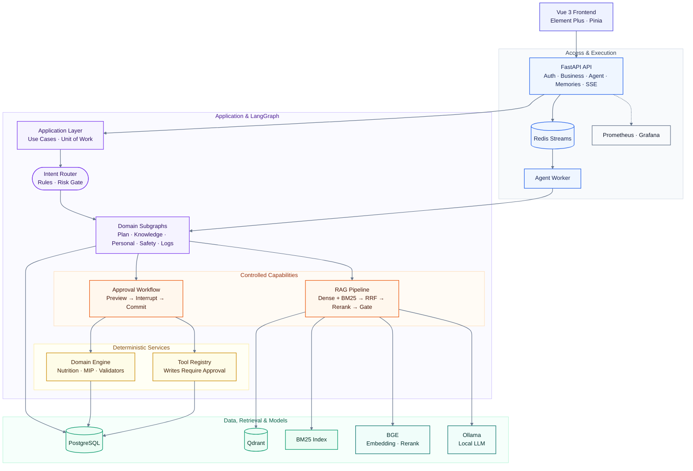

# FitPilot

**健身与营养 AI Agent 系统** —— 确定性领域引擎 + LLM 编排的本地优先个人训练/膳食助手。

[](https://github.com/your-org/fitpilot/actions)
[](https://github.com/your-org/fitpilot/actions)
[](backend/pyproject.toml)
[](frontend/package.json)
[](LICENSE)

FitPilot 把**结构化业务数据**（档案、食物库、动作库、计划、打卡）与**非结构化知识**（指南、FAQ、上传文档）统一到同一个 Agent 里：热量/宏量与计划约束由确定性代码计算，LLM 只负责编排与表达，不编造数值、不擅自写库。运行形态为 **Vue 3 前端 + FastAPI/LangGraph 后端** 的本地/容器 Web 系统，支持 Redis Streams 异步 Worker、RAG 混合检索与全链路人机审批。

> 不提供疾病诊断或伤病治疗建议；未经用户确认的任何计划不会写入生效。

---

## 亮点特性

### 🤖 Agent 能力

- **意图路由**：规则三级路由 + 风险词拦截，低置信进入澄清（clarify）流程
- **五条领域子图**：计划 / 知识 / 个人 / 安全 / 日志，基于 LangGraph 编译执行
- **人机审批（Human-in-the-loop）**：子图内 `interrupt()` 挂起 → SSE 推送 `approval_required`（含 Diff、数据依据、风险提示）→ 幂等 approve 续跑 commit/reject
- **Staged 草稿流**：计划预览 → 确认 → 提交，草稿幂等，不产生脏写；写工具经 Registry 守卫，未审批不可调用
- **受控记忆**：会话摘要 + 用户偏好候选；`confirm` 后可写回档案（`apply_to_profile`）
- **全状态检查点**：自研 `PostgresCheckpointSaver`，任务事件以 Postgres 为权威源，SSE 断线续传（`Last-Event-ID`）

### 🧮 领域引擎（确定性，不依赖 LLM 编造）

- **营养计算**：Mifflin-St Jeor 公式推导 TDEE 与宏量目标
- **配餐优化器**：OR-Tools MIP（SCIP）真实求解，失败自动回退贪心算法
- **训练计划**：模板化生成 + 硬约束校验器（频率/部位/恢复）
- **周度自适应调整**：基于近两周打卡数据的饮食+训练联合调整

### 📚 RAG 知识问答

- **多格式解析**：PDF / Office / 表格 / 图片（可选 OCR）/ 网页 → Parent-Child 分块
- **混合检索**：Dense（BGE 嵌入）+ BM25 → RRF 融合 → BGE rerank
- **证据门（Evidence Gate）**：低证据自动拒答，引用可逐条定位回原文；`build_context` 与门控判定收敛为同一套阈值
- **知识库工程化**：版本管理（index_version + 配置指纹）、增量入库、删除传播（Qdrant + BM25）、回滚/快照、一致性校验
- **离线可复现门禁**：`evals/rag_fixture` 固定语料 + 确定性哈希向量，CI 不依赖 Qdrant/Ollama/模型权重

### 🛡️ 工程可靠性

- **任务级韧性**：执行超时 + 协作式取消、stale 任务 reaper、TTL 定期清理
- **并发与配额**：每用户并发上限、per-user Token 预算熔断、登录限流
- **数据一致性**：行锁审批、幂等草稿、Redis Streams 消费组 + ACK/重试/死信
- **多层评估门禁**：parsing / agent / plan / meal / safety + 离线 RAG 检索/拒答（nDCG 等），CI 强制门禁；配置唯一权威为 `evals/eval_config.yaml`
- **可观测**：Prometheus metrics + Grafana provisioning dashboard、结构化日志（structlog）、可选 Langfuse tracing

---

## 架构总览



设计原则：API 不直接跑复杂 Agent；写操作必经 Application + 审批；Agent 通过 Tool Registry / Repository 访问数据；RAG 提供可定位证据，低证据拒答。

---

## 快速开始（本地开发）

**前置依赖**：Docker（Postgres/Redis）、[uv](https://docs.astral.sh/uv/)、Node.js + pnpm、[Ollama](https://ollama.com/)（本地 LLM）。本地模型权重下载见 [docs/MODEL_DOWNLOAD.md](docs/MODEL_DOWNLOAD.md)。

### 1. 启动基础设施

```bash
docker compose -f docker-compose.dev.yml up -d
```

dev compose 仅含 PostgreSQL（:5432）与 Redis（:6379）；Qdrant 默认使用本机已运行实例（:6333），如无则取消 `docker-compose.dev.yml` 中的注释。Ollama 运行在宿主机（:11434）。

### 2. 配置环境变量

```bash
cp .env.example .env   # 按需修改 Ollama 模型、端口等
```

### 3. 安装后端依赖并初始化数据

```bash
cd backend
uv sync

# 数据库迁移（11 个迁移链：0001–0011）
uv run python main.py migrate

# 种子数据：动作库 + 食物库（中文种子 + USDA FDC）+ 演示账号
uv run python main.py seed-exercises
uv run python main.py seed-foods
uv run python main.py seed-demo        # demo@fitpilot.local / demo123456

# 知识库入库（需 Qdrant + 嵌入模型）
uv run python main.py knowledge-ingest --incremental
```

### 4. 启动服务

```bash
# 后端 API（:8000，Swagger: http://127.0.0.1:8000/docs）
uv run python main.py api

# 可选：异步 Agent Worker（需 .env 中 AGENT_USE_WORKER=true）
uv run python main.py worker
```

另开一个终端，在**仓库根目录**启动前端（:5173）：

```bash
python main.py web        # 等价于 cd frontend && pnpm start（首次先 pnpm install）
```

浏览器访问 http://127.0.0.1:5173 ，用 `demo@fitpilot.local` / `demo123456` 登录。推荐演示流程见 [docs/DEMO.md](docs/DEMO.md)。

### 5. 健康检查

```bash
cd backend
uv run python main.py status            # HTTP 探测 /health/ready
uv run python main.py status --local    # 进程内探测 Postgres/Redis/Qdrant/Ollama
```

---

## Docker 全栈部署（生产）

`docker-compose.prod.yml` 一键拉起全栈：`frontend`（nginx）/ `backend` / `worker` / `migrate`（一次性 alembic）/ `postgres` / `redis` / `qdrant` / `prometheus` / `grafana`。

```bash
# 1. 准备环境文件（参考 .env.example，勿提交真实密钥）
cp .env.example .env
# 编辑 .env：设置强 JWT_SECRET、具体 CORS_ORIGINS、Ollama 模型等

# 2. 设置 compose 必需变量并启动
export POSTGRES_PASSWORD=<强随机值>
export GF_SECURITY_ADMIN_PASSWORD=<强随机值>
docker compose --env-file .env -f docker-compose.prod.yml up -d --build
```

### 必需环境变量

| 变量 | 必填 | 说明 |
|------|------|------|
| `POSTGRES_PASSWORD` | ✅（compose 强制） | Postgres 密码，同时用于 backend/worker/migrate 的 `DATABASE_URL` 拼接 |
| `GF_SECURITY_ADMIN_PASSWORD` | ✅（compose 强制） | Grafana 管理员密码 |
| `JWT_SECRET` | ✅（经 `.env`） | 生产必须强随机值，禁止沿用开发占位 |
| `CORS_ORIGINS` | ✅（经 `.env`） | 生产禁止 `*`，写具体前端源（如 `http://<服务器IP>:8080`） |
| `POSTGRES_USER` / `POSTGRES_DB` | 可选 | 默认 `fitpilot` |
| `FRONTEND_PORT` | 可选 | 前端对外端口，默认 `8080` |

说明：Ollama 默认运行在宿主机，容器经 `host.docker.internal:11434` 访问；本地 BGE 权重经 `./models` 只读挂载进容器（缺失时回退 HF 下载）。Grafana dashboard 自动 provisioning（`deploy/grafana/`）。

### 部署后验证

```bash
curl http://127.0.0.1:8000/health          # 存活
curl http://127.0.0.1:8000/health/ready    # 依赖就绪（Postgres/Redis/Qdrant/Ollama）
```

访问入口：前端 `http://<host>:8080`、API 文档 `http://<host>:8000/docs`、Grafana `http://<host>:3000`。

---

## 项目结构

```
FitPilot/
├── backend/                # FastAPI + LangGraph 后端（uv 管理，包名 fitpilot-backend）
│   ├── app/
│   │   ├── api/            # HTTP 路由（auth/users/plans/agent/knowledge/memories/health...）
│   │   ├── agents/         # 意图路由、领域工作流与子图、受控记忆、审批载荷
│   │   ├── graphs/         # LangGraph 主图 + PostgresCheckpointSaver
│   │   ├── application/    # 用例层（create/approve/cancel、commit_plan、confirm_memory）
│   │   ├── infrastructure/ # Repository + Unit of Work
│   │   ├── rag/            # 解析/分块/检索/证据门/知识生命周期
│   │   ├── worker/         # Redis Streams 消费组（ACK/重试/死信）
│   │   ├── eval/           # 多层评估、离线 RAG 门禁与 CI gate
│   │   └── cli.py          # fitpilot CLI（Typer）
│   ├── tests/              # 95 个 pytest 用例
│   └── Dockerfile          # 多阶段构建（uv 锁定、非 root）
├── frontend/               # Vue 3.5 + Vite + TS + Element Plus + Pinia（8 个视图）
│   └── tests/              # vitest（auth store + api client，12 个用例）
├── migrations/             # Alembic 迁移（0001–0011）
├── evals/                  # 评测集 + eval_config.yaml + rag_fixture 离线语料
├── knowledge_base/         # 语料 raw/ + BM25 索引
├── models/                 # 本地 BGE 嵌入/重排权重
├── scripts/                # 种子/入库/备份脚本（经 CLI 调用）
├── deploy/                 # prometheus.yml + Grafana provisioning/dashboards
├── docs/                   # 架构、评估、演示、审查等文档
├── docker-compose.dev.yml  # 开发基础设施（postgres + redis）
├── docker-compose.prod.yml # 生产全栈
├── alembic.ini
└── main.py                 # 根目录短命令入口（api/web/eval/status...）
```

---

## 测试与评估

### 后端（95 个 pytest 用例 + ruff）

```bash
cd backend
uv run python main.py test          # 等价 uv run python -m pytest -q tests/
uvx ruff check app main.py          # lint（CI 使用 E9,F63,F7,F82,F401,F841 规则集）
```

### 前端（12 个 vitest 用例 + 类型检查）

```bash
cd frontend
pnpm install
pnpm typecheck                      # vue-tsc -b
pnpm test                           # vitest run
pnpm build                          # vue-tsc -b && vite build
```

### 多层评估

```bash
cd backend
uv run python main.py eval-gate     # CI 离线门禁：parsing/agent/plan/meal/safety + 离线 RAG 检索/拒答
uv run python main.py eval-all      # 全量 9 层评估（Hit@K / MRR / nDCG / 引用 / 时延）
uv run python main.py eval          # RAG 单层评估（需已 ingest + Qdrant）
uv run python main.py eval-all --persist   # 报告写入 evaluation_runs 表
```

离线门禁基于 `evals/rag_fixture` 固定语料 + 确定性哈希向量，**不依赖 Qdrant/Ollama/模型权重**，可在 CI 裸环境运行。权威配置为 `evals/eval_config.yaml`（JSON 版已移除）。评估体系详见 [docs/EVAL.md](docs/EVAL.md)。

### CI 门禁

| Workflow | 触发 | 覆盖 |
|----------|------|------|
| `ci.yml` | push / PR | ruff fatal 规则、95 个后端测试、离线评估门禁（含 `retrieval_offline` / `no_answer_offline`，报告输出 `evals/reports/ci_gate.json`） |
| `frontend-ci.yml` | frontend 变更 | vue-tsc 类型检查、vitest、生产构建 |
| `online-eval.yml` | 定时/手动 | LLM-as-judge / 在线 RAG（需 secrets，失败不阻断） |

---

## 常用 CLI 命令

所有命令在 `backend/` 下以 `uv run python main.py <cmd>` 运行（或 `uv run fitpilot <cmd>`）；仓库根目录 `python main.py <cmd>` 为透传别名，`python main.py web` 专指启动前端。

| 命令 | 作用 |
|------|------|
| `api` / `worker` | 启动 API（:8000）/ Agent Worker |
| `migrate` | Alembic upgrade head |
| `seed-exercises` / `seed-foods` / `seed-demo` | 动作库 / 食物库 / 演示数据 |
| `ingest` / `knowledge-ingest` | 知识入库（后者默认增量，支持 `--reset` `--prune`） |
| `knowledge-diff` / `knowledge-delete` / `knowledge-consistency` | 语料差异 / 删除传播 / BM25-Qdrant 一致性校验 |
| `knowledge-index-version` / `knowledge-rollback` / `knowledge-snapshot` | 索引版本查看 / 回滚 / Qdrant 快照 |
| `eval` / `eval-all` / `eval-gate` / `eval-agent` / `eval-no-answer` | 各层评估 |
| `status` | 依赖就绪探测（`--local` 免 HTTP） |
| `backup` / `restore` | Postgres + BM25 备份恢复 |
| `test` | 运行 pytest |

---

## 文档导航

| 文档 | 内容 |
|------|------|
| [docs/ARCHITECTURE.md](docs/ARCHITECTURE.md) | 架构图与关键路径 |
| [docs/DEMO.md](docs/DEMO.md) | 10 分钟演示清单 |
| [docs/EVAL.md](docs/EVAL.md) | 多层评估体系与命令 |
| [docs/INGEST_FORMATS.md](docs/INGEST_FORMATS.md) | 知识入库支持格式 |
| [docs/MODEL_DOWNLOAD.md](docs/MODEL_DOWNLOAD.md) | 本地模型权重下载 |
| [docs/ENGINEERING_ENHANCEMENT.md](docs/ENGINEERING_ENHANCEMENT.md) | Agent/RAG 增强落地说明 |
| [docs/ENGINEERING_REVIEW.md](docs/ENGINEERING_REVIEW.md) | 工程审查要点 |
| [docs/PROJECT_AUDIT_2025.md](docs/PROJECT_AUDIT_2025.md) | 项目全面审查与改进方案 |
| [docs/archive/README-full-archive.md](docs/archive/README-full-archive.md) | 上一版根 README 全量归档 |
| [docs/archive/README-v1.md](docs/archive/README-v1.md) | 更早的历史全量 README |
| [backend/README.md](backend/README.md) / [frontend/README.md](frontend/README.md) | 前后端子项目说明 |

---

## License 与免责声明

本项目以 [MIT License](LICENSE) 发布（如仓库尚未包含 LICENSE 文件，请以实际声明为准）。

> **健康免责声明**：FitPilot 生成的训练与饮食建议仅基于一般性营养学与训练学规则，供个人参考，**不构成医疗建议、诊断或治疗方案**。如有疾病、伤病、孕期或其他特殊健康状况，请先咨询医生或注册营养师。

<!-- 徽章中的 your-org/fitpilot 为占位，请替换为实际仓库路径 -->
