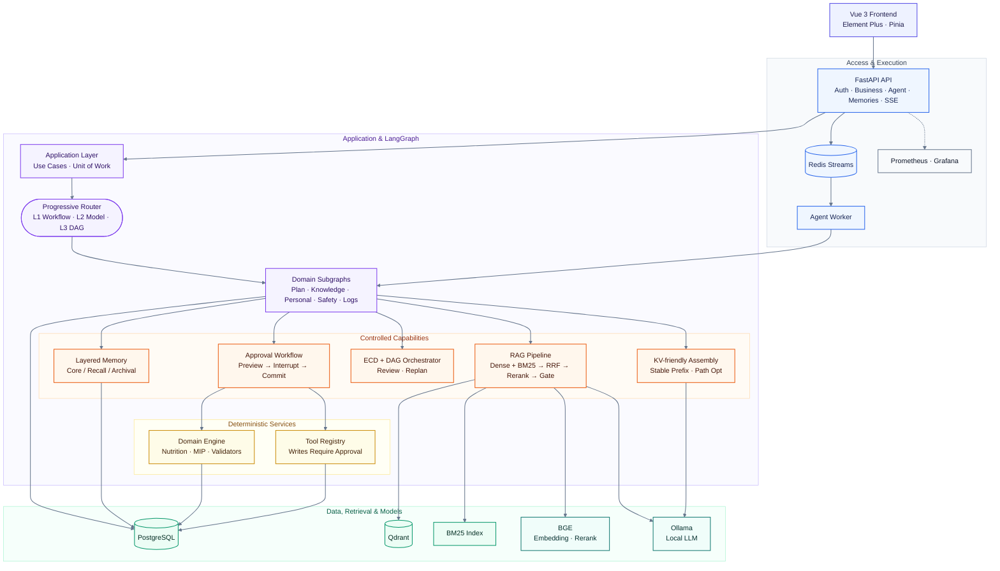

# FitPilot

**健身与营养 AI Agent 系统** —— 确定性领域引擎 + LLM 编排的本地优先个人训练/膳食助手。

[](https://github.com/yytbjx/FitPilot/actions)
[](https://github.com/yytbjx/FitPilot/actions)
[](backend/pyproject.toml)
[](frontend/package.json)
[](LICENSE)

FitPilot 把**结构化业务数据**（档案、食物库、动作库、计划、打卡）与**非结构化知识**（指南、FAQ、上传文档）统一到同一个 Agent 里：热量/宏量与计划约束由确定性代码计算，LLM 只负责编排与表达，不编造数值、不擅自写库。

当前版本在原有 LangGraph 五条领域子图之上，补齐了三项运行时能力：

1. **分层对话记忆**：近期轮次保留，历史写入 PostgreSQL（摘要 + 向量），按当前问题召回并扩展邻近轮次  
2. **KV Cache 友好装配**：稳定前缀（约束 / 工具审批门 / 权限）+ Append-Only 近期会话 + 检索后置；历史片段在 Token 预算下做有序路径优化  
3. **渐进式意图编排**：L1 确定性工作流 → L2 模型辅助 → L3 ECD 拆解 + DAG 并行调度 + 对抗审查 + Checkpoint 失败隔离

运行形态为 **Vue 3 前端 + FastAPI / LangGraph 后端** 的本地/容器 Web 系统，支持 Redis Streams 异步 Worker、RAG 混合检索与全链路人机审批。

> 不提供疾病诊断或伤病治疗建议；未经用户确认的任何计划不会写入生效。

---

## 亮点特性

### 🤖 Agent 与编排

- **渐进式三层路由**：高置信规则走确定性工作流；中置信可模型辅助；复杂依赖进入多 Agent DAG
- **ECD + DAG**：复杂计划按实体-约束-依赖拆解，无依赖节点并行；每步对抗审查与结构化共识
- **失败隔离**：节点级 Checkpoint，失败只重置受影响子树并局部重规划（`ORCHESTRATOR_ENABLED`）
- **五条领域子图**：计划 / 知识 / 个人 / 安全 / 日志，基于 LangGraph 编译执行
- **人机审批（Human-in-the-loop）**：子图内 `interrupt()` → SSE `approval_required` → 幂等 approve 续跑
- **Staged 草稿流**：预览 → 确认 → 提交；写工具经 Registry 守卫，未审批不可调用
- **全状态检查点**：自研 `PostgresCheckpointSaver`，任务事件以 Postgres 为权威源

### 🧠 上下文与记忆

- **分层记忆（Core / Recall / Archival）**：表 `conversation_memory`（迁移 `0012`）；活跃 K 轮 + 摘要向量召回 + 邻近半径 R
- **KV Cache 友好装配**：稳定前缀版本化（`STABLE_PREFIX_VERSION`）；动态检索 / 记忆注入后置，降低前缀分叉
- **路径优化选片**：收益=相关性，代价=长度 / 跨片段间隔 / 前缀分叉成本，受 `CONTEXT_TOKEN_BUDGET` 约束
- **受控长期偏好**：用户偏好候选；`confirm` 后可写回档案（`apply_to_profile`）
- **会话摘要**：任务结束后压缩为结构化 session summary（与对话记忆并存）

### 🧮 领域引擎（确定性，不依赖 LLM 编造）

- **营养计算**：Mifflin-St Jeor 推导 TDEE 与宏量目标
- **配餐优化器**：OR-Tools MIP（SCIP），失败回退贪心
- **训练计划**：模板化生成 + 硬约束校验（频率 / 部位 / 恢复）
- **周度自适应调整**：近两周打卡数据的饮食 + 训练联合调整

### 📚 RAG 知识问答

- **多格式解析**：PDF / Office / 表格 / 图片（可选 OCR）/ 网页 → Parent-Child 分块
- **混合检索**：Dense（BGE）+ BM25 → RRF → BGE rerank
- **证据门（Evidence Gate）**：低证据拒答；引用可定位回原文
- **知识库工程化**：版本管理、增量入库、删除传播、回滚 / 快照、一致性校验
- **离线可复现门禁**：`evals/rag_fixture` + 确定性哈希向量，CI 不依赖外部服务

### 🛡️ 工程可靠性

- **任务级韧性**：超时、协作式取消、stale reaper、TTL 清理
- **并发与配额**：每用户并发上限、Token 预算熔断、登录限流
- **数据一致性**：行锁审批、幂等草稿、Redis Streams ACK / 重试 / 死信
- **多层评估**：parsing / retrieval / no_answer / generation / agent / plan / meal / safety / **context_kv**；配置权威为 `evals/eval_config.yaml`
- **可观测**：Prometheus + Grafana、structlog、可选 Langfuse

---

## 架构总览



设计原则：API 不直接跑复杂 Agent；写操作必经 Application + 审批；动态检索不破坏稳定前缀；RAG 低证据拒答；复杂任务用可检查点的 DAG 而非黑盒多 Agent 投票。

---

## 快速开始（本地开发）

**前置依赖**：Docker（Postgres/Redis）、[uv](https://docs.astral.sh/uv/)、Node.js + pnpm、[Ollama](https://ollama.com/)。本地模型权重见 [docs/MODEL_DOWNLOAD.md](docs/MODEL_DOWNLOAD.md)。

### 1. 启动基础设施

```bash
docker compose -f docker-compose.dev.yml up -d
```

dev compose 含 PostgreSQL（:5432）与 Redis（:6379）；Qdrant 默认用本机实例（:6333）。Ollama 在宿主机（:11434）。

### 2. 配置环境变量

```bash
cp .env.example .env
```

与上下文 / 编排相关的可选项（均有默认值）：

| 变量 | 含义 |
|------|------|
| `CONVERSATION_MEMORY_ENABLED` | 分层对话记忆开关 |
| `CONVERSATION_CORE_K` / `CONVERSATION_RECALL_N` / `CONVERSATION_NEIGHBOR_RADIUS` | 活跃轮次 / 召回数 / 邻近半径 |
| `CONTEXT_TOKEN_BUDGET` | 上下文装配 Token 预算 |
| `ORCHESTRATOR_ENABLED` | 复杂任务 ECD+DAG 编排 |

### 3. 安装后端依赖并初始化数据

```bash
cd backend
uv sync

# 数据库迁移（0001–0012，含 conversation_memory）
uv run python main.py migrate

uv run python main.py seed-exercises
uv run python main.py seed-foods
uv run python main.py seed-demo        # demo@fitpilot.local / demo123456

uv run python main.py knowledge-ingest --incremental
```

### 4. 启动服务

```bash
uv run python main.py api              # :8000，Swagger: /docs
# 可选：.env 中 AGENT_USE_WORKER=true
uv run python main.py worker
```

仓库根目录启动前端（:5173）：

```bash
python main.py web
```

浏览器访问 http://127.0.0.1:5173 ，演示账号见 [docs/DEMO.md](docs/DEMO.md)。

### 5. 健康检查

```bash
cd backend
uv run python main.py status
uv run python main.py status --local
```

---

## Docker 全栈部署（生产）

`docker-compose.prod.yml` 一键拉起：`frontend` / `backend` / `worker` / `migrate` / `postgres` / `redis` / `qdrant` / `prometheus` / `grafana`。

```bash
cp .env.example .env
export POSTGRES_PASSWORD=<强随机值>
export GF_SECURITY_ADMIN_PASSWORD=<强随机值>
docker compose --env-file .env -f docker-compose.prod.yml up -d --build
```

生产务必设置强 `JWT_SECRET`，且 `CORS_ORIGINS` 禁止单独使用 `*`。详见 `.env.example`。

---

## 项目结构

```
FitPilot/
├── backend/
│   ├── app/
│   │   ├── api/                 # HTTP 路由
│   │   ├── agents/
│   │   │   ├── routing.py       # 规则意图路由
│   │   │   ├── orchestration/   # 三层路由 · ECD · DAG · 对抗审查
│   │   │   ├── context_assembly.py  # KV Cache 友好装配 + 路径优化
│   │   │   ├── memory/          # 会话摘要 / 用户偏好 / 分层对话记忆
│   │   │   └── workflows/       # 领域工作流与子图
│   │   ├── graphs/              # 主图 + PostgresCheckpointSaver
│   │   ├── models/              # SQLAlchemy ORM（含 conversation_memory）
│   │   ├── rag/                 # 解析 / 检索 / 证据门 / 生命周期
│   │   ├── eval/                # 多层评估（含 context_kv）
│   │   └── cli.py
│   └── tests/
├── frontend/                    # Vue 3.5 + Vite + Element Plus + Pinia
├── migrations/                  # Alembic 0001–0012
├── evals/
│   ├── large/ · fewshot/        # 大/小评测总集
│   ├── rag_fixture/             # 离线 RAG 语料
│   └── eval_config.yaml         # 模块开关与阈值（唯一权威）
├── knowledge_base/              # 语料 raw/ + BM25
├── models/                      # 本地 BGE 权重（不入库，见 docs/MODEL_DOWNLOAD.md）
├── scripts/
├── docs/
├── docker-compose.dev.yml
├── docker-compose.prod.yml
└── main.py                      # 根目录短命令入口
```

---

## 测试与评估

### 后端 / 前端

```bash
cd backend && uv run python main.py test
cd frontend && pnpm test && pnpm typecheck
```

### 多层评估

```bash
cd backend
uv run python main.py eval-gate --suite-set small   # CI 同款离线门禁（含 context_kv）
uv run python main.py eval-all --suite-set small    # 小集全量（含在线 RAG，需服务就绪）
uv run python main.py eval-all --suite-set large    # 大集容量回归（默认）
```

| 层 | 模块 | 说明 |
|----|------|------|
| 1 | parsing | 文档解析 |
| 2 | retrieval / retrieval_offline | Hit@K / MRR / nDCG / Precision / TermRecall |
| 2b | no_answer | 拒答 Recall / Precision |
| 3 | generation | 引用与检索规则 |
| 4 | agent | 意图准确率 / Macro-F1 |
| 5–7 | plan / meal / safety | 计划硬约束 / 食谱 / 风险 |
| 8 | **context_kv** | 占用减少 / Recall@Budget / LCP / 三层路由 / DAG |

**读数注意**：`small`（fewshot）是冒烟种子集，题少且精选，Hit@K 等易接近满分；严肃验收请跑 `large`，并区分 Hit 与 Precision。`context_kv` 当前侧重算法/结构回归，不替代真实长会话线上评测。详见 [`docs/EVAL.md`](docs/EVAL.md)、[`evals/README.md`](evals/README.md)。

### CI

| Workflow | 覆盖 |
|----------|------|
| `ci.yml` | ruff、pytest、`eval-gate --suite-set small` |
| `frontend-ci.yml` | vue-tsc、vitest、生产构建 |
| `online-eval.yml` | 可选在线 RAG / LLM-as-judge（需 secrets） |

---

## 常用 CLI

| 命令 | 作用 |
|------|------|
| `api` / `worker` | 启动 API / Agent Worker |
| `migrate` | Alembic upgrade head（含 0012） |
| `seed-*` / `knowledge-ingest` | 种子与知识入库 |
| `eval` / `eval-all` / `eval-gate` | 评估；`--suite-set large\|small` |
| `status` | 依赖就绪探测 |
| `test` | pytest |

---

## 文档导航

| 文档 | 内容 |
|------|------|
| [docs/ARCHITECTURE.md](docs/ARCHITECTURE.md) | 架构与关键路径 |
| [docs/DEMO.md](docs/DEMO.md) | 演示清单 |
| [docs/EVAL.md](docs/EVAL.md) | 评估体系与指标口径 |
| [docs/INGEST_FORMATS.md](docs/INGEST_FORMATS.md) | 入库格式 |
| [docs/MODEL_DOWNLOAD.md](docs/MODEL_DOWNLOAD.md) | 本地模型下载 |
| [docs/ENGINEERING_ENHANCEMENT.md](docs/ENGINEERING_ENHANCEMENT.md) | 增强落地说明 |
| [backend/README.md](backend/README.md) / [frontend/README.md](frontend/README.md) | 子项目说明 |

---

## License 与免责声明

本项目以 [MIT License](LICENSE) 发布（如仓库尚未包含 LICENSE 文件，请以实际声明为准）。

> **健康免责声明**：FitPilot 生成的训练与饮食建议仅基于一般性营养学与训练学规则，供个人参考，**不构成医疗建议、诊断或治疗方案**。如有疾病、伤病、孕期或其他特殊健康状况，请先咨询医生或注册营养师。
