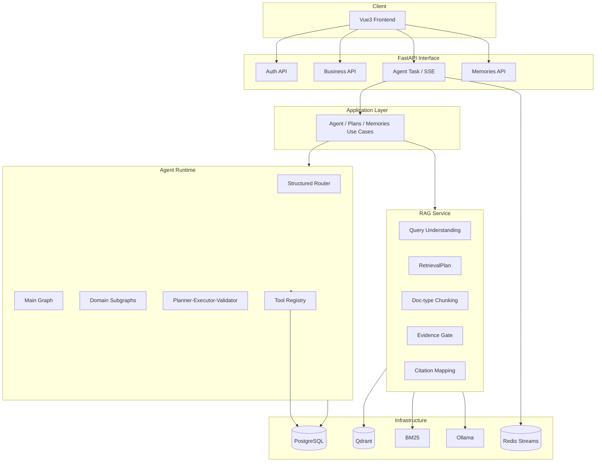

# FitPilot 架构概览

## 原则

- API 不直接跑复杂 Agent；写操作经 Application + 审批
- Agent 经 Tool Registry / Repository，不直接散落 ORM
- RAG 提供可定位证据；低证据拒答
- 任务状态与 SSE 事件以 Postgres 为权威源

## 关键路径

| 能力 | 路径 |
|------|------|
| 主图 | `backend/app/graphs/fitness_graph.py` |
| 子图 | `backend/app/agents/workflows/graphs/` |
| 用例 | `backend/app/application/` |
| 持久化 | `backend/app/infrastructure/persistence/` |
| 知识生命周期 | `backend/app/rag/knowledge_lifecycle.py` |
