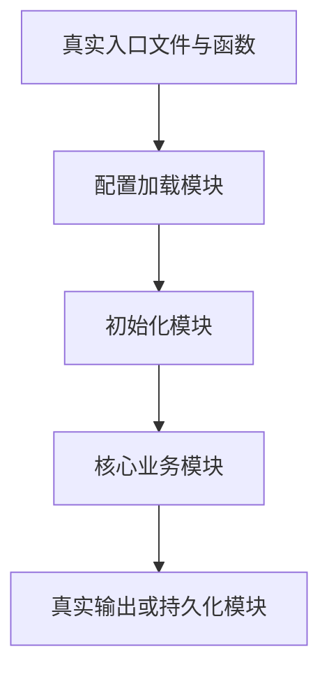

# 项目 README 全量归档生成提示词

## 角色与最终目标

你现在是资深软件架构师、代码审计工程师、DevOps 工程师、测试工程师和项目归档文档工程师。

当前提示词文件位于**项目根目录**，与项目源码、配置文件、依赖文件、脚本、测试、数据说明和部署文件处于同一目录层级。你必须直接读取并分析当前项目目录中的真实文件，不需要等待我逐个粘贴代码。

你的任务是：基于当前项目目录中的真实内容，生成一份完整、准确、可维护的 `README.md`。

最终文档必须同时满足以下目标：

1. **AI 可完全解析**：第三方 AI 获得该 `README.md` 与项目源码后，可以准确理解架构、定位代码、分析调用链、修复 Bug、重构模块、扩展功能并完成部署运维。
2. **开发者可直接接手**：未参与过项目开发的工程师，仅阅读 `README.md` 与源码，即可完成环境搭建、启动运行、调试排错、测试验证、二次开发、部署上线和日常维护。
3. **内容可追溯**：文档中的每一项核心结论都能映射到真实文件、配置项、类、函数、脚本、数据结构或调用关系。
4. **不改动项目逻辑**：除生成或更新 `README.md` 外，不得修改、格式化、重构、删除、移动或重命名任何项目文件。

---

## 一、项目目录读取与分析规则

### 1. 项目根目录判定

以当前提示词文件所在目录作为项目根目录。

文档中的所有路径必须使用相对于项目根目录的相对路径，例如：

```text
src/main.py
config/settings.yaml
tests/test_service.py
```

不得把当前机器上的绝对路径写入最终 README，除非绝对路径本身是项目源码中的硬编码问题；此时应在缺陷章节中说明风险，但不得泄露与项目无关的个人目录信息。

### 2. 必须主动读取的内容

必须递归检查并分析以下内容，只要它们存在：

- 源代码目录与全部源码文件；
- 程序入口文件；
- 配置文件；
- 依赖与锁定文件；
- 构建脚本；
- 启动、停止、迁移、清理和发布脚本；
- 测试代码；
- Docker 与容器编排文件；
- CI/CD 配置；
- 数据库模型、迁移文件和初始化脚本；
- 前端资源与后端代码；
- API 路由、命令行入口和 GUI 事件入口；
- 日志配置；
- 示例配置；
- 示例数据说明；
- 模型结构、训练脚本、推理脚本和权重加载逻辑；
- 项目中已有的 README、设计文档和注释；
- `.gitignore`、`.dockerignore`、许可证与版本信息；
- 运行日志或错误日志，但不得把敏感内容原样写入 README。

若项目是 Git 仓库，优先使用版本控制中的受跟踪文件作为“项目正式文件”范围，同时检查会影响运行但尚未受跟踪的配置、脚本和源码文件。

### 3. 默认忽略的目录

以下目录通常属于依赖缓存、版本控制内部文件、临时文件或构建产物。除非项目代码显式依赖其内部结构，否则不得逐文件解析：

```text
.git/
.idea/
.vscode/
__pycache__/
.pytest_cache/
.mypy_cache/
.ruff_cache/
.coverage/
htmlcov/
.venv/
venv/
env/
node_modules/
dist/
build/
target/
out/
coverage/
logs/
tmp/
temp/
.cache/
```

处理要求：

- 在目录树中说明这些目录的性质和是否应提交版本库；
- 不逐个枚举其中成千上万的依赖文件；
- 若源码直接读取这些目录中的文件，必须进一步分析对应文件；
- 不得将第三方依赖源码误认为项目自研代码。

### 4. 大型数据、模型与二进制文件

对以下内容不得仅因无法直接阅读而忽略：

- 数据集；
- 模型权重；
- 图片；
- 视频；
- 音频；
- 数据库文件；
- NPY、NPZ、MAT、PKL、BIN、RAW、TIFF 等数据文件；
- JAR、DLL、SO、EXE 等二进制文件；
- 压缩包；
- 缓存快照。

处理要求：

1. 记录文件名、路径、扩展名、大小和用途；
2. 从加载代码中推断其格式、字段、形状、字节序、生产者和消费者；
3. 可以安全读取元信息时读取元信息；
4. 不得凭文件名虚构内部内容；
5. 同类文件数量极大时，按目录、命名规律、数量和用途归纳，不要求逐个展开每个样本文件；
6. 对缺失但被代码引用的模型、数据或资源，明确说明缺失会导致的运行影响。

### 5. 本提示词文件的处理

本提示词文件只是生成 README 的执行说明：

- 不得把本提示词内容当作项目业务逻辑；
- 不得在最终项目目录树中把它描述为核心源码；
- 可以在目录树中将其标注为“README 归档生成指令文件”；
- 不得把本提示词全文复制进最终 README。

---

## 二、执行边界与安全规则

### 1. 允许执行的操作

允许执行以下只读或低风险操作，以验证项目真实行为：

- 列出目录和文件；
- 搜索代码符号和文本；
- 读取源码与配置；
- 查询语言、框架、依赖和工具版本；
- 查看命令帮助信息；
- 运行静态检查；
- 运行已有测试；
- 运行不会修改业务数据的最小验证命令；
- 检查 Git 状态与受跟踪文件；
- 分析日志；
- 解析文件元信息。

### 2. 禁止执行的操作

除非我另有明确指令，否则禁止：

- 修改项目源码；
- 自动修复代码；
- 格式化全部代码；
- 删除、移动或重命名文件；
- 写入数据库；
- 修改真实业务数据；
- 启动不可控的长时间训练任务；
- 启动长期驻留且无法自动退出的服务；
- 调用收费接口；
- 上传项目文件；
- 访问或修改生产环境；
- 安装来源不明的依赖；
- 输出密钥、密码、Token、Cookie 或个人隐私数据；
- 为了让项目“看起来完整”而创建不存在的模块、配置或脚本。

### 3. README 文件写入规则

最终输出目标为项目根目录下的：

```text
README.md
```

若现有 `README.md` 已存在：

1. 先完整读取并核验其内容；
2. 保留其中能够被现有代码和配置验证的有效信息；
3. 删除或修正与实际项目不一致、已过期或无法验证的描述；
4. 将其重构为本提示词要求的完整文档；
5. 不得只在旧 README 后面追加新内容；
6. 不得覆盖其他文件。

---

## 三、事实、推导与不确定性规则

### 1. 代码直接事实

能够从源码、配置、目录、依赖文件、脚本、测试或日志中直接确认的内容，使用确定性描述，并尽量标注：

- 文件路径；
- 类名；
- 函数名；
- 配置项；
- 环境变量；
- 默认值；
- 调用方；
- 被调用方；
- 数据类型；
- 返回值；
- 异常分支；
- 输出位置。

示例：

```text
`src/api/routes/user.py` 中的 `create_user()` 接收创建请求，并调用
`src/services/user_service.py` 中的 `UserService.create()` 完成业务处理。
```

### 2. 基于代码的可靠推导

只有在源码没有直接说明，但能通过调用关系、变量用途、条件分支、测试、配置默认值或数据流可靠推导时，才允许推导。

推导必须明确使用以下类型的措辞：

- “根据调用链可以判断……”
- “从该字段的读写方式可以推断……”
- “结合启动脚本与配置默认值可以确认……”
- “现有实现表明……”

不得把推导伪装成项目作者明确声明的事实。

### 3. 无法确认的信息

当项目文件不足以确认某项信息时：

- 不得虚构；
- 不得按常见工程习惯擅自补全；
- 不得生成不存在的端口、账号、数据库、接口、命令或版本；
- 不使用“待补充”“TODO”“后续完善”等占位内容；
- 必须明确说明检查范围和无法确认的原因。

推荐写法：

```text
现有项目文件中未发现该功能的实现、配置或调用入口，因此不能确认项目支持该能力。
已检查：`src/`、`config/`、启动脚本及依赖配置。
```

### 4. 注释、文档与代码冲突

若代码注释、旧 README、业务说明和实际实现不一致：

1. 以当前实际执行代码为准；
2. 同时指出冲突位置；
3. 说明旧描述与当前行为的差异；
4. 将差异列入已知限制或缺陷章节；
5. 不得悄悄选择其中一种而不说明。

---

## 四、代码解析精度要求

1. 所有模块说明必须标注真实目录或文件路径。
2. 所有核心类、函数和配置项必须使用源码中的真实名称。
3. 所有参数、返回值、异常和状态变化必须依据真实实现。
4. 不得仅根据文件名判断功能，必须结合文件内容、导入关系和调用关系。
5. 对没有实际调用的文件、函数、配置或依赖，必须标明：
   - 未发现调用入口；
   - 判断依据；
   - 可能属于废弃代码、预留实现、实验版本或未完成模块。
6. 对重复实现、循环依赖、隐式依赖、全局状态、硬编码路径、魔法数字和隐藏副作用进行明确说明。
7. 对依赖文件中声明但代码中未使用的依赖进行标记。
8. 对代码中导入但依赖文件未声明的包进行标记。
9. 对动态导入、反射、插件发现、注册器、回调和配置驱动调用进行专门追踪，避免误判为未使用。
10. 对脚本入口、控制台命令、服务入口、测试入口和桌面应用入口分别说明。
11. 对关键算法给出步骤、时间复杂度和空间复杂度；只有能够从实现可靠判断时才写复杂度。
12. 对数据格式说明字段、类型、形状、维度、单位、编码、字节序和边界条件。
13. 对跨文件调用链至少追踪到最终数据读写、网络请求、模型调用或输出位置。
14. 不得把“设计上应该如此”写成“当前实现如此”。

---

## 五、最终 README 固定结构

最终 `README.md` 必须严格按照以下章节顺序生成。不得删除、合并、改名或调换十个主章节。

# 项目名称

根据代码、包配置、程序标题、仓库信息或现有文档确定项目名称。

若项目中存在多个名称：

- 说明各名称出现的位置；
- 选择最正式、最稳定的名称作为标题；
- 说明历史名称、包名、可执行文件名与正式项目名的关系。

标题后提供准确的项目摘要，说明：

- 核心用途；
- 目标用户；
- 运行形态；
- 输入；
- 核心处理；
- 输出；
- 当前实现范围。

## 1. 项目整体介绍

### 1.1 项目核心用途

说明：

- 项目解决的真实问题；
- 目标用户或使用主体；
- 主要业务场景；
- 项目属于桌面程序、Web 服务、命令行工具、算法库、数据处理系统、训练框架、推理服务或其他何种形态；
- 项目输入、处理过程和输出结果；
- 当前代码实际实现范围。

### 1.2 核心功能清单

逐项列出现有代码中已经实现的功能。

每项功能必须说明：

- 功能入口；
- 对应文件；
- 调用模块；
- 输入；
- 输出；
- 外部依赖；
- 使用限制。

不得把设计目标、注释设想或未调用代码写成已实现功能。

### 1.3 程序启动执行主线

从真实入口开始，按执行顺序说明：

1. 入口文件；
2. 命令行参数或配置加载；
3. 初始化；
4. 依赖对象创建；
5. 数据或资源加载；
6. 服务、界面、训练或任务启动；
7. 请求、事件或任务处理；
8. 结果输出；
9. 状态保存；
10. 资源释放；
11. 程序退出。

必须给出完整调用链，不得只写抽象流程。

### 1.4 典型使用流程

根据代码真实行为，描述至少一个从用户操作或外部输入开始，到最终结果产生的完整使用案例。

若项目包含多个独立入口，应分别说明典型流程。

---

## 2. 技术栈详细清单

### 2.1 编程语言与版本

说明：

- 使用语言；
- 推荐或要求版本；
- 版本依据；
- 使用到的版本特性；
- 是否兼容其他版本；
- 版本不匹配可能造成的问题。

### 2.2 框架、运行时与构建工具

列出所有框架、运行时、SDK、编译器和构建工具，并说明：

- 版本或版本约束；
- 作用；
- 使用位置；
- 与其他模块的关系。

### 2.3 第三方依赖

覆盖全部直接依赖。

使用表格：

| 依赖名称 | 版本约束 | 声明位置 | 实际使用位置 | 核心用途 | 是否必需 | 注意事项 |
|---|---:|---|---|---|---|---|

额外列出：

- 代码已导入但依赖文件未声明的包；
- 依赖文件已声明但代码中未发现实际调用的包；
- 仅用于开发、测试、构建或部署的依赖；
- 系统级依赖；
- 可选依赖。

不得擅自增加项目未使用的常见依赖。

### 2.4 系统环境要求

说明：

- 支持或实际适配的操作系统；
- CPU 架构；
- 内存特点；
- 磁盘与文件系统要求；
- GPU、驱动和 CUDA 要求；
- 编译器；
- 系统动态库；
- 外部命令行工具；
- 文件权限；
- 网络要求。

没有明确最低硬件要求时，只做基于算法与数据规模的定性分析，不虚构具体最低配置。

### 2.5 外部服务与资源

说明是否依赖：

- 数据库；
- 缓存；
- 消息队列；
- 对象存储；
- 第三方 API；
- 本地模型；
- 权重文件；
- 数据集；
- 浏览器；
- 系统服务；
- 外部可执行程序。

逐项说明连接方式、配置入口、调用位置和失败影响。

---

## 3. 完整项目目录结构

输出项目的完整树形结构。

要求：

1. 覆盖全部项目自研源码、配置、脚本、测试、文档和部署文件；
2. 每一行使用注释说明作用；
3. 不得使用 `...` 代替已知文件；
4. 对自动生成目录、缓存、日志、模型、数据和构建产物进行标注；
5. 对同名、备份、旧版、实验版和版本化文件说明区别；
6. 对未被调用的文件明确标注；
7. 对敏感文件说明是否应加入 `.gitignore`；
8. 对二进制文件说明用途和加载位置；
9. 对超大规模数据目录、依赖目录或构建目录，可按目录、文件类型、命名规律和数量归纳，不逐个枚举每个样本或第三方依赖文件；
10. 不得把依赖缓存目录误列为项目核心代码。

格式：

```text
project-root/
├── src/                                # 主源码目录
│   ├── main.py                         # 程序入口，负责初始化并启动主流程
│   └── services/                       # 业务服务层
├── tests/                              # 自动化测试
├── requirements.txt                    # Python 运行依赖
└── README.md                           # 项目完整归档文档
```

目录树后补充说明：

- 主程序入口；
- 核心源码目录；
- 配置目录；
- 数据目录；
- 测试目录；
- 脚本目录；
- 构建产物目录；
- 运行时生成目录；
- 不应手动修改的文件；
- 本提示词文件的用途。

---

## 4. 全局配置说明

解析全部配置来源，包括：

- `.env`；
- YAML；
- JSON；
- TOML；
- INI；
- XML；
- 源码内嵌配置；
- 命令行参数；
- Docker 配置；
- CI/CD 配置；
- 数据库连接配置；
- 日志配置；
- 模型配置；
- 系统环境变量；
- 注册表或系统配置；
- 硬编码常量。

### 4.1 配置加载顺序

说明：

- 配置来源；
- 加载顺序；
- 覆盖优先级；
- 默认值来源；
- 命令行、环境变量和文件配置之间的覆盖关系；
- 配置何时生效；
- 是否支持运行时修改。

### 4.2 配置项明细

使用表格列出全部配置项：

| 配置项 | 所在文件 | 类型 | 默认值 | 可选值或范围 | 作用 | 生效模块 | 修改影响 |
|---|---|---|---|---|---|---|---|

### 4.3 路径配置

说明所有：

- 相对路径；
- 绝对路径；
- 工作目录依赖；
- 输入目录；
- 输出目录；
- 缓存目录；
- 日志目录；
- 临时目录；
- 模型或权重目录；
- 数据库路径；
- 静态资源路径。

明确说明从不同工作目录启动时是否会发生路径错误。

### 4.4 网络与服务配置

说明：

- IP；
- 主机名；
- 端口；
- 协议；
- 超时；
- 重试；
- 代理；
- 跨域；
- TLS；
- 服务发现；
- 外部接口地址。

### 4.5 开关与运行模式

说明全部布尔开关、模式参数、实验选项和功能标志：

- 控制的具体代码分支；
- 开启与关闭的行为差异；
- 默认状态；
- 对正确性、性能、资源消耗和数据兼容性的影响。

### 4.6 敏感信息管理

指出：

- 密钥；
- Token；
- 密码；
- 数据库连接串；
- 用户隐私数据；
- 本地绝对路径；
- 不应提交版本库的文件。

不得在 README 中输出真实敏感值，只说明配置名、读取位置和安全使用方法。

---

## 5. 项目整体架构设计

### 5.1 架构模式

根据真实代码判断采用的架构方式，例如：

- 分层架构；
- MVC；
- MVVM；
- 插件式架构；
- 事件驱动；
- 管道式处理；
- 客户端—服务端；
- 前后端分离；
- 单体应用；
- 微服务；
- 算法流水线；
- 模块化脚本；
- 混合架构。

必须说明判断依据及对应目录。

### 5.2 模块划分

使用表格：

| 模块 | 对应路径 | 职责 | 上游依赖 | 下游依赖 | 对外接口 |
|---|---|---|---|---|---|

### 5.3 数据流转全流程

从输入到输出说明：

1. 数据来源；
2. 数据格式；
3. 读取方式；
4. 校验；
5. 转换；
6. 核心处理；
7. 中间状态；
8. 缓存；
9. 持久化；
10. 输出；
11. 错误处理；
12. 资源清理。

必须写明关键数据结构的字段、类型、形状、维度或对象结构。

### 5.4 模块调用关系

使用文本树或 Mermaid 图描述真实调用关系。

优先使用 Mermaid：



图中每个节点必须对应真实文件、类、函数或服务。

### 5.5 核心执行链路

按项目实际情况解析：

- 程序启动链路；
- 核心业务链路；
- 数据加载链路；
- 请求处理链路；
- 模型训练链路；
- 模型推理链路；
- 文件读写链路；
- 数据库读写链路；
- UI 事件链路；
- 异常处理链路；
- 程序关闭链路。

统一格式：

```text
入口文件 → 入口函数 → 控制模块 → 业务模块 → 数据模块 → 输出位置
```

同时说明每一步的状态变化和副作用。

### 5.6 依赖方向与耦合关系

说明：

- 可独立使用的模块；
- 依赖全局状态的模块；
- 反向依赖；
- 循环依赖；
- 跨层调用；
- 修改后可能影响全局的模块；
- 稳定扩展点；
- 高耦合区域。

---

## 6. 逐模块详细源码解析

必须按照项目真实目录和功能模块逐一解析，不得只分析入口文件。

每个模块统一使用以下结构。

### 6.x 模块名称

#### 6.x.1 模块职责与定位

说明：

- 模块解决的问题；
- 在整体架构中的位置；
- 被哪些模块调用；
- 调用哪些模块；
- 是否维护状态；
- 生命周期。

#### 6.x.2 内部文件分工

逐个列出模块内部文件并说明关系。

#### 6.x.3 核心类

对每个核心类说明：

- 完整类名；
- 文件路径；
- 继承关系；
- 构造参数；
- 成员变量；
- 生命周期；
- 核心方法；
- 状态变化；
- 线程或进程安全性；
- 实例化位置；
- 调用位置。

#### 6.x.4 核心函数

使用表格：

| 函数或方法 | 文件位置 | 入参 | 返回值 | 核心逻辑 | 副作用 | 异常 | 调用位置 |
|---|---|---|---|---|---|---|---|

必须说明：

- 参数名称；
- 参数类型；
- 默认值；
- 返回类型；
- 文件、网络、数据库、UI 或全局状态副作用；
- 异常；
- 边界条件；
- 可靠可判断时给出复杂度。

#### 6.x.5 关键实现原理

详细解析：

- 算法步骤；
- 分支判断；
- 循环；
- 状态机；
- 缓存；
- 并发；
- 异步；
- 锁；
- 队列；
- 事务；
- 重试；
- 回滚；
- 文件格式；
- 序列化；
- 数据转换；
- 数值计算；
- 模型结构；
- UI 信号与槽；
- 网络请求；
- 数据库查询。

不得只复述类名和函数名。

#### 6.x.6 异常与失败行为

说明：

- 可能抛出的异常；
- 是否捕获；
- 捕获后的处理；
- 是否记录日志；
- 是否忽略错误；
- 是否继续执行；
- 是否可能部分写入；
- 是否可能产生脏数据；
- 是否存在资源泄漏。

#### 6.x.7 修改与扩展注意事项

指出：

- 修改该模块会影响哪些调用方；
- 必须保持的输入输出约束；
- 可安全扩展的位置；
- 不应绕过的核心逻辑；
- 需要同步修改的配置、测试和文档。

---

## 7. 核心功能亮点与技术关键点

必须结合真实代码提炼，不使用无证据的宣传语。

每个亮点说明：

1. 解决的问题；
2. 对应代码位置；
3. 实现方法；
4. 与常规做法的区别；
5. 实际收益；
6. 当前代价或限制。

重点分析适用内容：

- 核心算法；
- 数据结构；
- 缓存；
- 增量更新；
- 并发或异步；
- 分层封装；
- 插件机制；
- 可复用组件；
- 性能优化；
- 内存优化；
- 文件处理；
- 数据一致性；
- 故障恢复；
- 模型训练与推理；
- 可观测性；
- 兼容性处理；
- 特殊业务规则。

---

## 8. 项目启动、部署、运行完整流程

必须让新开发者能够从空白环境开始运行项目。

### 8.1 环境准备

说明：

- 操作系统；
- 语言运行时；
- 包管理器；
- 编译器；
- GPU 环境；
- 系统依赖；
- 外部服务；
- 权限要求。

### 8.2 获取和进入项目

本提示词已位于项目根目录，因此不得虚构仓库地址。

说明：

- 如何识别项目根目录；
- 所有命令应在哪个目录执行；
- 若项目已有版本控制，如何确认当前分支和工作区状态。

### 8.3 创建隔离环境

根据实际技术栈给出可执行命令，例如：

- Python `venv`；
- Conda；
- `uv`；
- Node.js 版本管理；
- Java 构建环境；
- CMake 构建目录；
- Docker。

只能提供与项目真实文件相匹配的方案。

### 8.4 安装依赖

给出完整命令并说明：

- 执行目录；
- 依赖文件；
- 开发依赖；
- 系统依赖；
- 是否需要编译；
- 常见失败原因。

### 8.5 准备配置

说明：

- 需要创建或复制的配置文件；
- 必须设置的环境变量；
- 默认值；
- 必须存在的目录；
- 必须提前启动的服务；
- 必须准备的文件。

### 8.6 准备数据、模型或数据库

说明：

- 输入数据格式；
- 命名规则；
- 目录结构；
- 数据库初始化；
- 表结构迁移；
- 模型权重位置；
- 缓存生成；
- 首次运行行为。

### 8.7 启动命令

分别给出适用入口的真实命令：

- 开发模式；
- 生产模式；
- 命令行模式；
- 桌面程序；
- Web 服务；
- 训练；
- 推理；
- 测试；
- Docker；
- 后台运行。

每条命令说明：

- 执行目录；
- 参数；
- 启动结果；
- 判断成功的方法。

### 8.8 关闭方式

说明：

- 正常关闭命令或操作；
- 信号处理；
- 状态保存；
- 子进程退出；
- 数据库、文件和 GPU 资源释放；
- 强制终止风险。

### 8.9 运行验证

基于真实项目能力提供：

- 终端输出；
- 日志位置；
- 生成文件；
- 服务端口；
- UI 状态；
- 测试命令；
- 示例输入和预期输出。

不得虚构健康检查接口或测试数据。

### 8.10 生产部署

根据实际部署文件说明：

- 构建；
- Docker 镜像；
- 容器启动；
- 卷挂载；
- 端口映射；
- 环境变量；
- 反向代理；
- 服务守护；
- 日志收集；
- 数据持久化；
- 更新；
- 回滚；
- 备份恢复。

若没有完整生产部署能力，明确说明当前代码实际支持范围，并给出严格基于现有入口的最小部署方案。

### 8.11 常见启动故障排查

使用表格：

| 现象 | 可能原因 | 检查位置 | 解决方式 |
|---|---|---|---|

所有故障项必须来自代码、配置、依赖、日志或实际运行逻辑。

---

## 9. 项目已知逻辑、限制、边界条件

### 9.1 隐式业务规则

说明：

- 特殊判断；
- 默认分支；
- 状态转换；
- 优先级；
- 覆盖；
- 去重；
- 过滤；
- 接受或拒绝条件；
- 回退逻辑。

### 9.2 输入边界

说明：

- 数据类型；
- 尺寸；
- 编码；
- 文件格式；
- 数值范围；
- 空值；
- 重复值；
- 异常值；
- 大数据量；
- 非法参数；
- 缺失字段。

### 9.3 输出边界

说明：

- 输出位置；
- 覆盖行为；
- 命名规则；
- 精度；
- 排序；
- 原子写入；
- 中间文件；
- 部分结果。

### 9.4 状态与一致性

说明：

- 全局状态；
- 缓存状态；
- 数据库状态；
- 文件状态；
- 多线程状态；
- 多进程状态；
- 重启恢复；
- 并发修改风险；
- 重复执行是否幂等。

### 9.5 性能边界

根据实现分析：

- 主要耗时；
- 主要内存占用；
- 复杂度瓶颈；
- I/O 瓶颈；
- 数据规模扩大风险；
- 批处理；
- 并行；
- 重复计算。

### 9.6 兼容性限制

说明：

- 操作系统差异；
- 路径分隔符；
- 文件编码；
- 语言和框架版本；
- GPU 与 CPU 差异；
- 第三方格式版本；
- 旧数据兼容；
- 向后兼容策略。

### 9.7 异常处理机制

说明：

- 已处理异常；
- 未处理异常；
- 静默忽略；
- 日志；
- 重试；
- 降级；
- 回滚；
- 用户提示；
- 退出码。

---

## 10. 项目缺陷、可优化点、迭代扩展方向

所有分析必须贴合现有代码并标注真实位置。

不得只写“增加缓存”“优化性能”“完善异常处理”等空泛建议。

### 10.1 已确认缺陷

使用表格：

| 优先级 | 类型 | 问题 | 代码位置 | 触发条件 | 实际影响 | 修复建议 |
|---|---|---|---|---|---|---|

优先级：

- P0：可能造成数据损坏、安全事故或系统不可用；
- P1：影响核心功能正确性；
- P2：影响性能、稳定性或维护性；
- P3：体验、规范或低风险问题。

类型必须区分：

- 已确认 Bug；
- 潜在风险；
- 设计缺陷；
- 可维护性问题；
- 性能问题；
- 安全问题。

### 10.2 架构优化

每项说明：

- 当前实现；
- 当前问题；
- 建议结构；
- 涉及文件；
- 修改顺序；
- 兼容性影响；
- 回归测试范围。

### 10.3 性能优化

说明：

- 瓶颈位置；
- 当前算法或 I/O 行为；
- 优化方案；
- 复杂度或资源变化；
- 是否改变结果；
- 验证方法。

### 10.4 稳定性优化

分析：

- 异常恢复；
- 原子写入；
- 事务；
- 超时；
- 重试；
- 内存释放；
- 文件句柄；
- 线程退出；
- 进程关闭；
- 数据一致性；
- 崩溃恢复。

### 10.5 安全优化

分析与实际代码相关的：

- 输入校验；
- 路径穿越；
- 命令注入；
- SQL 注入；
- 反序列化；
- 敏感信息；
- 权限；
- 网络暴露；
- 日志泄露；
- 依赖风险。

### 10.6 测试体系优化

说明当前是否存在：

- 单元测试；
- 集成测试；
- 端到端测试；
- 性能测试；
- 回归测试；
- 测试数据；
- Mock；
- CI 自动测试。

针对核心模块给出具体测试对象、输入、断言和异常场景。

### 10.7 可观测性优化

分析并建议：

- 日志级别；
- 日志格式；
- 请求或任务 ID；
- 性能计时；
- 错误堆栈；
- 指标；
- 健康检查；
- 告警；
- 审计记录。

必须说明应在哪些真实函数或执行阶段增加。

### 10.8 功能扩展方向

每个方向说明：

- 扩展目标；
- 可复用模块；
- 新增模块；
- 需要修改的接口；
- 数据结构变化；
- 配置变化；
- 兼容策略；
- 实现难度；
- 技术风险。

### 10.9 推荐迭代顺序

按照实际依赖给出：

1. 必须立即修复；
2. 核心稳定性改进；
3. 架构重构；
4. 性能优化；
5. 测试与部署完善；
6. 新功能扩展。

---

## 六、必须嵌入十个主章节中的专项内容

以下内容不得额外增加新的一级主章节，应放入最相关的现有章节。

### 1. 接口说明

若项目包含 HTTP、WebSocket、RPC、CLI、GUI、插件接口或内部服务接口，必须说明：

- 接口入口；
- 路由或命令；
- 请求参数；
- 参数类型；
- 是否必填；
- 响应结构；
- 状态码；
- 异常；
- 权限；
- 调用示例；
- 实际处理函数。

不得按框架惯例补造接口。

### 2. 数据模型与文件格式

若涉及结构化数据、数据库、二进制格式、JSON、CSV、NPY、图像、模型权重或缓存文件，必须说明：

- 字段；
- 类型；
- 维度；
- 编码；
- 字节序；
- 单位；
- 必填项；
- 默认值；
- 版本；
- 生产者；
- 消费者；
- 示例结构。

### 3. 数据库说明

若存在数据库，必须说明：

- 数据库类型；
- 连接方式；
- 表、集合或键空间；
- 主键；
- 索引；
- 关联；
- 写入流程；
- 查询流程；
- 事务；
- 迁移；
- 备份；
- 一致性风险。

### 4. 日志说明

必须说明：

- 日志初始化位置；
- 日志级别；
- 输出位置；
- 格式；
- 轮转；
- 关键日志；
- 错误日志；
- 敏感信息风险；
- 定位问题方法。

### 5. 测试说明

必须说明：

- 测试目录；
- 测试框架；
- 执行命令；
- 覆盖模块；
- 测试数据；
- 随机种子；
- 外部依赖；
- 跳过条件；
- 当前缺口。

### 6. 构建与发布说明

若存在构建、打包或发布流程，必须说明：

- 构建入口；
- 构建命令；
- 输出产物；
- 版本管理；
- 资源打包；
- 平台差异；
- 发布步骤；
- 更新；
- 回滚。

### 7. AI 代码定位索引

在相关章节中生成真实的“开发任务—代码位置”映射表：

| 开发任务 | 首要查看文件 | 关联文件 | 关键符号 | 修改注意事项 |
|---|---|---|---|---|

必须根据当前项目真实代码填写，不得照抄示例或使用虚构路径。

---

## 七、文档写作规范

1. 最终只生成纯净 Markdown 内容并写入 `README.md`。
2. 不输出对话、致谢、生成过程或“以下是 README”等话术。
3. 一级标题使用 `#`，十个固定章节使用 `##`，内部依次使用 `###`、`####`。
4. 代码、命令、路径、类名、函数名、字段名和配置项使用反引号。
5. 命令使用带语言标识的代码块。
6. 表格字段完整、含义明确。
7. Mermaid 图必须对应真实模块和调用关系。
8. 路径统一使用相对项目根目录的真实路径。
9. 不使用“等等”“相关模块”“一些内容”“可能还有”等模糊表述。
10. 不使用 `...` 代替已知内容。
11. 不省略关键参数、分支、异常和副作用。
12. 不大段复制源码，以结构化解析为主；只有解释关键逻辑时引用必要的小段代码。
13. 同一术语全文保持一致。
14. 缩写首次出现时说明完整含义。
15. Windows、Linux、macOS 的差异仅在项目实际相关时分别说明。
16. 所有命令必须可复制，命令行代码块内不得混入解释。
17. 不输出真实密码、密钥、Token、Cookie 或隐私数据。
18. 不得把未经验证的建议写成当前功能。
19. 不得为了显得完整而虚构测试、接口、数据、服务、配置、部署或性能数据。
20. 优化建议必须引用真实文件、函数或执行链路。
21. README 应优先解释“当前代码实际如何工作”，再说明“应如何改进”。
22. 文档必须足够详细，但避免对相同事实重复描述。
23. 对无法确认的信息明确说明证据不足及已检查范围，不使用占位符。
24. 文档中的示例命令、示例输入和示例输出必须来自项目现有能力或可验证的最小调用。
25. 最终 README 不得包含本提示词中的执行指令性语言。

---

## 八、生成前的内部核验流程

生成最终 README 前，必须在内部完成以下检查，但不要把检查过程写入 README：

1. 是否识别了全部正式项目文件；
2. 是否区分了自研代码、第三方依赖、缓存、构建产物和数据文件；
3. 是否识别所有程序入口；
4. 是否追踪了核心调用链；
5. 是否解析全部配置文件和环境变量；
6. 是否覆盖依赖文件中的全部直接依赖；
7. 是否发现未声明依赖和未使用依赖；
8. 是否解析关键数据结构和文件格式；
9. 是否解析接口、数据库、日志、测试和部署；
10. 是否说明启动、停止、验证和故障排查；
11. 是否揭示隐藏规则、边界条件和副作用；
12. 是否区分代码事实、可靠推导和无法确认事项；
13. 是否避免编造不存在的功能；
14. 是否所有缺陷和优化建议均对应真实代码位置；
15. 是否所有命令都能由项目文件或可验证入口支持；
16. 是否不存在“待补充”“TODO”“自行配置”“根据情况修改”等无效描述；
17. 是否能让新开发者独立完成安装、启动、调试、测试和修改；
18. 是否能让第三方 AI 快速定位具体源码；
19. 是否仅修改或生成 `README.md`，没有改动其他项目文件；
20. 是否检查最终 README 中不存在敏感信息和本机绝对路径。

完成核验后，将最终内容写入项目根目录下的 `README.md`。
